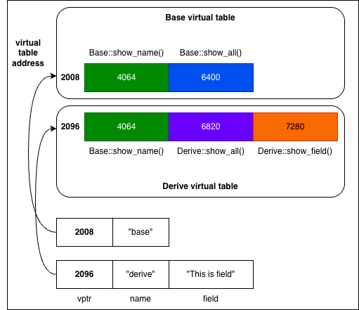

# Polymorphism

同一个接口，在不同对象上表现出不同的行为。

## 编译期多态 (Static Polymorphism)

取决于对象声明的类型。
```cpp
class Animal {
public:
    void speak() { std::cout << "Animal sound\n"; }
};

class Dog : public Animal {
public:
    void speak() { std::cout << "Woof\n"; }
};

Animal* obj = new Dog();
obj.speak(); // Animal sound
```

另一种编译器多态是[template](./templates.md)。

## 运行期多态 (Dynamic Polymorphism)

取决于对象指向的类型。

```cpp
class Animal {
public:
    virtual void speak() { std::cout << "Animal sound\n"; }
};

class Dog : public Animal {
public:
    void speak() override { std::cout << "Woof\n"; }
};

Animal* obj = new Dog();
obj->speak(); // Woof
```

## 对比
| Static | Dynamic |
| :---: | :---: |
| ✅ compiler | ❌ compiler |
| Overload | Override |
| different parameters / signature / return type | same parameters / signature, but associated in a class / subclass |
| function overloading, templates, CRTP | virtual function ➕ pointers |
| fast execution, zero-cost abstraction | slow execution |
| ✅ inline<sup>[1]</sup> | ❌ cannot inline |
| ✅ optimization<sup>[2]</sup> | ❌ no optimization |
| ❌ code bloat<sup>[3]</sup> | ✅ code won't bloat |
| less flexible<sup>[4]</sup> | more flexible |
| 高性能库，泛型编程，数值计算 | 需要[ABI](./abi.md)稳定 |

> [1] inline 指的是编译器把函数调用替换成函数体本身，而不是进行一次真正的函数调用。

> [2] static支持一些优化，因为编译器可以明确代码是什么；而dynamic需要运行的时候再检查
> * Constant Propagation: 如果一个变量是常量值，那么编译器直接替换
> ```cpp
> int x = 2;
> int y = x + 3; // replace with `int y = 2 + 3;`
> ```
> * Dead Code Elimination: 编译器删除永远不会执行的代码
> * Loop Optimization
>   * Loop Unrolling (循环展开)
>   * Loop Invariant Code Motion (移动循环中的固定计算)
>   * Strength Reduction (昂贵运算替换)
> ```cpp
> // loop unrolling
> for (int i = 0; i < 2; ++i) {arr[i] = 0;} // -> arr[0] = 0, arr[1] = 0;
> 
> // loop invariant code motion
> for (int i = 0; i < n; ++i) {int x = a + b; arr[i] = x * i;} // move `int x = a + b;` outside loop
>
> // strength reduction
> for (int i = 0; i < n; ++i) {x = i * 8;} // multiply -> add, change it to `x += 8;`
> ```

> [3] Code Bloat &rarr; 代码膨胀，比如模版函数对每种类型都生成一个函数导致binary变大

> [4] 对于静态多态，有一些问题比如：类型难以统一(`Base<A>`和`Base<B>`是两个类型)，接口也非常复杂`static_cast<Derived*>(base_ptr)`。但是对于动态多态则不会：可以使用base ptr来代表class和subclass(`vector<Base*> derived`)。

---

# virtual

虚函数通过vtable虚函数表实现。每个对象内部包含一个vptr虚指针指向vtable。

```cpp
class Base {
    char name[40];
public:
    virtual void show_name();
    virtual void show_all();
};

class Derive : public Base {
    char name[40];
    char field[40];
public:
    void show_all();
    virtual void show_field();
};

Base base("base");
Derive derive("derive", "This is field");
```


如果使用下面的方法调用，那么相当于如下流程
```cpp
Base* ptr = &derive;
ptr->show_all();
```
```
ptr --> (2096) --> show_all --> (6820) --> 函数定义
```

---

# pure virtual

用于定义接口，不能被实例化。该类被称为抽象类(Abstract Class / ABC)。

```cpp
class Interface {
    virtual void speak() =0;

    int function() { return 1024; }
    virtual void walk() { std::cout << "walk in interface\n"; }
}

class Impl : public Interface {
    void speak() override { std::cout << "speak\n"; }
    void walk() { std::cout << "walk in impl\n"; }
}

Interface interface; // ❌
Impl impl; // ✅
```

---

# CRTP

CRTP (Curiously Recurring Template Pattern)是一种编译期多态技术，其特点是**子类把自己当作父类的模版参数** `class Child : Parent<Child>`。

```cpp
template<typename Derived>
class Base {
public:
    void interface() {
        static_cast<Derived*>(this)->implementation();
    }
};

class Derived : public Base<Derived> {
public:
    void implementation() {
        std::cout << "Derived implementation\n";
    }
};
```

CRTP的核心作用
* 用编译期多态替代部分虚函数 (零虚调用开销，可inline)
* 在基类里复用逻辑，同时调用派生类实现
* 做静态接口约束 (配合 concepts / SFINAE)
* 性能更好 (没有vtable)

CRTP适合"要多态行为，但更在意性能和编译期约束"的地方。

---

# `std::variant` vs 多态

请参考[std::variant 和 std::visit](./std-variant-and-visit.md)。
