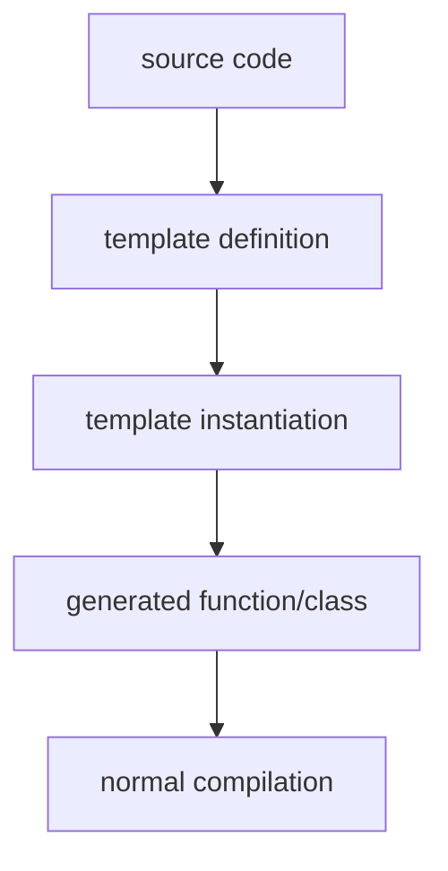

# 什么是 Template

`template` 是 C++ 的泛型编程（**generic programming**）机制，允许编写类型无关的代码。这样程序员就不用重复编写逻辑相同只是处理不同类型数据的函数。

`template` 并不是运行时机制，它是编译期代码生成系统


---

# Template 的流程

```
template call
     │
     ▼
template argument deduction
     │
     ▼
substitution
     │
     ├── failure → SFINAE → remove candidate
     │
     ▼
overload resolution
     │
     ▼
template chosen
     │
     ▼
template instantiation
     │
     ├── error → compile error
     │
     ▼
generated code
```

---

# 编译期实例化

编译器会根据实际使用的类型生成具体函数或类的实例 (**instantiation**）。

```cpp
template<typename T>
T add(T a, T b) {
    return a + b;
}
```
当代码使用：
```cpp
add<int>(1,2);
add<double>(1.0,2.0);
```
编译器会生成：
```cpp
int add(int a, int b);
double add(double a, double b);
```

> [!NOTICE]
> `template` 的实现必须放在 header 文件中。假设 template 函数定义在 header 然后实现在 cpp，那么编译失败 `undefined reference`。
> 
> 普通函数只需要有声明即可，linker会在后续从 .o 文件中找到对应的 **“唯一”** 的实现。
> 
> 而 `template` 只是定义了一个 **“如何生成代码”** 的指导手册，只有在遇到具体调用的时候才会生成代码。
> ```cpp
> // add.h
> template<typename T>
> T add(T a,T b){
>     return a+b;
> }
> ```
> ```cpp
> // main.cpp
> #include "add.h"
> 
> int main() {
>     add<int>(1, 2);
>     add<double>(1.0, 2.0);
> }
> ```
> 
> 如果 template 写在 .cpp，那么编译器在 main.cpp 看不到 template 定义，因此无法实例化。因为当编译器看到 `add<int>(1, 2);` 就知道有需要根据手册生成一个支持 int 类型的函数 `int add(int,int);`，看到 `add<double>(1.0, 2.0);` 就知道需要生成支持 double 的`double add(double, double);`。但是 **template 可以支持任何类型，且不同类型的函数逻辑可能并不相同**，所以需要在读取声明(即访问 .h 文件)的时候就知道通用的函数逻辑或针对某种类型应该是什么样的逻辑。

> [!NOTICE]
> 对于普通函数，如果把函数定义在 header 中会违反ODR。
>```cpp
> // util.h
> int function(int a, int b) {...};
>
> // a.cpp
> #include "util.h"
>
> // b.cpp
> #include "util.h"
> ```
> 那么链接的时候会出现 `a.o --> int function(int, int)` 和 `b.o --> int function(int, int)` 两个一模一样的。
>
> 但是对于 template 函数，由于必须定义在 header 中，所以编译器有特殊处理。
> ```cpp
> // util.h
> template<typename T>
> T function(T a, T b) {...}
>
> // a.cpp
> #include "util.h"
> function(1, 2);
> 
> // b.cpp
> #include "util.h"
> function(1, 2);
> ```
> 其中两者都生成了 `a.o --> int function<int>(int, int);` 和 `b.o --> int function<int>(int, int);`，但是 C++ 标准允许 template 的多个相同实例，Linker 会把它们合并 (COMDAT folding / weak symbol)，这叫做 **ODR-use compatible**。

---

# 特化 (specialization)

比如 template 针对某些特殊类型具有特定的逻辑，那么我们就叫 “特殊化” 这些函数定义。

| | 全特化 | 偏特化 |
| :---: | :---: | :---: |
| **函数模板** | ✅ | ❌ |
| **类模板** | ✅ | ✅ |

> 对于函数，因为有函数重载 (overload) 所以没有必要偏特化，编译器会自动选择更匹配的函数。


* 全特化 &rarr; 所有参数都固定
```cpp
template<typename T>
T func(T t) {...}

template<>
int func(int t) {...}
```

* 偏特化 &rarr; 固定部分参数
```cpp
template <typename T, typename U>
class MyClass {...}

template <typename T>
class MyClass<T, int> {...}

// ⚠️ 不能调用 `MyClass<int, int>` 因为有两个定义都匹配
// 报错 `ambiguous partial specialization`
template <typename T>
class MyClass<T, T> {...}
```
```cpp
template <typename T>
class MyClass {...}

// 这个也是偏特化，针对指针
template <typename T>
class MyClass<T*> {...}
```

> ⚠️ 类型的指针和引用也算是一种类型！即`int`和`int*`是两种类型！

对于 template 函数，下面的内容都是正确的，只不过它们不是偏特化而是函数重载，因此不会出现 `MyClass<int, int> --> ambiguous partial specialization` 的错误，编译器会**自动匹配 “更具体” 的函数**。
```cpp
template <typename T>
void func(T t) {...}

template <typename T, typename U>
void func2(T t, U u) {...}

// 这个是函数重载不是偏特化
// ⚠️ `void func<T*>(T* t)` 是错误的，因为我们现在是重载不是偏特化
template <typename T>
void func(T* t) {...}

// 这个是函数重载不是偏特化
// ⚠️ `void func2<T, int>(T t, int u)` 是错误的，因为我们现在是重载不是偏特化
template <typename T>
void func2(T t, int u) {...}
```
---

# Variadic template

允许不定参数。
```cpp
template<typename... Args>
void print(Args... args) {
    (std::cout << ... << args);
}
```

---
# NTTP (Non-Type Template Parameter)

即传入模版的不是类型，而是**编译期常量**。

```cpp
template<int size>
struct Array {
     int data[size];
}

Array<10> arr;
```
当然也可以使用`auto`来代替。

```cpp
template<auto V>
struct Const { static constexpr auto value = V; };

Const<42> x;
Const<'A'> y;

```

还可以使用别的结构化类型。
```cpp
struct Config {
    int level;
    bool fast;
    constexpr bool operator==(const Config&) const = default;
};

template<Config C>
struct Engine {};
```

> ⚠️ 不要滥用，代码膨胀可能会非常明显，比如使用`template<int N>`，传入的N不同就会在编译期产生不同的代码，比如`Array<1>`和`Array<2>`就有两份代码。

---

# 高级功能

* [SFINAE](./what-is-SFINAE.md)
* [concept](./what-is-concept.md)
* [CRTP](./what-is-polymorphism.md#CRTP)
* [Compile-time Computation](./what-is-compile-time-computation.md)
* [type traits](./what-is-type-traits.md)
* [allocator model](./what-is-allocator.md)

