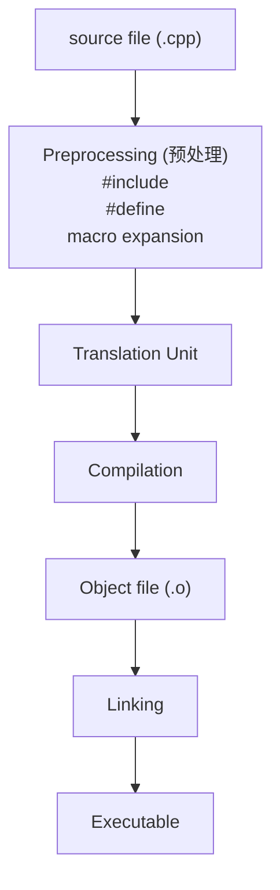

# 什么是 Traslate Unit

Translation Unit（翻译单元）是C++编译的最基本单位。一个 `.cpp` 文件在 **预处理之后** 的完整代码，就是一个 Translation Unit。

> [!NOTICE]
> Translation Unit = .cpp + 所有include展开后的完整代码



每个 Translation Unit:
* 独立编译
* 不知道其他 TU 的实现
* 只能看到 声明
* TU 通过 linker 链接

---

# ODR (One Definition Rule)

一个实体在整个程序中只能有一个定义。这也就是为什么对于普通函数而言，定义不能写在 header 文件中。当多个 cpp 文件 include 该 header，那么就会出现多个TU包含相同的函数定义。

但是对于template，我们需要把函数定义实现在header中因为本质上template并不是定义，而是一个帮助生成定义的“手册”。详情参考[template](./what-is-template.md)。

| 类型 | 是否允许 | 原因 |
| :---: | :---: | :---: |
| 普通函数 | ❌ | ODR violation |
| inline function | ✅ | 允许多定义 |
| template function | ✅ | 编译期实例化 |
| static function | ✅ | internal linkage |
| constexpr function | ✅ | 默认 inline |

---

# internal vs external linkage

Linkage指的是：一个名字 变量/函数/对象 在多个TU之间是否指向同一个实体。简单说就是不同 .cpp 文件看到的这个名字，是不是同一个东西。

```
// external linkage
file1.cpp ----\
                > global_var
file2.cpp ----/

// internal linkage
file1.cpp ----> var
file2.cpp ----> var
```

##### external linkage
这个名字在整个 program 中是**唯一的**，可以被多个TU共享。
```cpp
// utils.h
extern int global_var;
void func();
```
```cpp
// utils.cpp
int global_var = 10;
void func() {}
```
```cpp
// main.cpp
#include "utils.h"

void main() {
    global_var = 20;
    func();
}
```

##### internal linkage
这个名字只在当前TU可见，即使多个TU出现同名内容也不会冲突。

```cpp
// file1.h
static int x = 10;
```
```cpp
// file2.h
static int x = 10;
```

一般使用 `static` 和 `anonymous namespace` 可以实现。

---

# inline
如果我们在header中定义的函数或者全局变量是inline的则不会触发ODR问题。因为inline function允许多个identical definition。

---

# constexpr

详情[constexpr](./what-is-constexpr.md)。