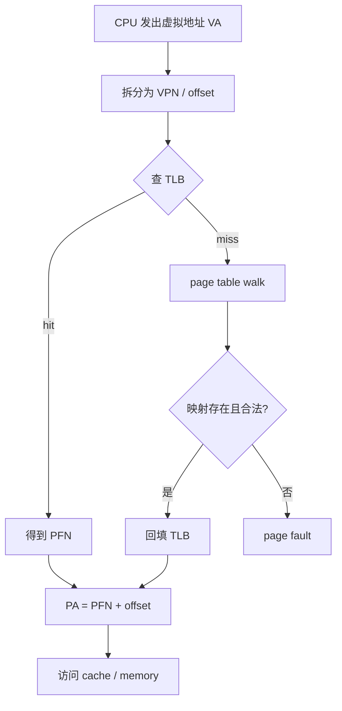

# 虚拟内存

现代操作系统通常不给进程直接使用“物理内存地址”，而是让进程看到一套**虚拟地址空间（Virtual Address Space）**。

这样做有几个核心目的：

- **隔离**：不同进程彼此隔离，不能随便访问对方内存
- **安全**：用户态程序不能直接乱碰内核内存
- **简化编程**：程序总觉得自己拥有一段连续地址空间
- **灵活管理**：操作系统可以按需分配物理页，实现换页、共享内存、内存映射文件等功能

所以，CPU 执行 load/store 指令时，程序里写的地址通常是**虚拟地址（VA, Virtual Address）**，真正访问内存前，需要转换成**物理地址（PA, Physical Address）**。

* 虚拟地址（Virtual Address）&rarr; 程序看到的地址
* 物理地址（Physical Address）&rarr; 真正对应到 DRAM 芯片上的地址
> 例如指针 `p = 0x7fff12345678`，这通常是一个虚拟地址。

---

# 页（Page）

虚拟内存和物理内存一般都按固定大小的块进行管理。

## 页框 / 物理页框（Page Frame）

物理内存中的一个页大小的槽位。虚拟页最终要映射到某个物理页框。

## 页表（Page Table）

页表是操作系统和硬件共同使用的一种数据结构，用来记录：

- 某个虚拟页映射到哪个物理页框
- 这个映射是否有效
- 是否可读 / 可写 / 可执行
- 是否允许用户态访问
- 是否被访问过
- 是否被修改过（dirty）

## 页表项（Page Table Entry）

页表中的每一项叫页表项。一个典型页表项通常包含：

- **PFN / PPN**：物理页框号
- **Present / Valid bit**：该映射是否存在
- **R/W/X bit**：是否可读/写/执行
- **User/Supervisor bit**：用户态是否可访问
- **Accessed / Referenced bit**：是否被访问过
- **Dirty bit**：是否被写过
- **Cache control bits**：是否允许 cache、写回策略等

如果页表项标记为 invalid / not present，那么访问该地址时可能会触发page fault。

---

# 虚拟地址的基本结构

通常一个虚拟地址会拆成两部分：

- **虚拟页号 VPN（Virtual Page Number）**
- **页内偏移 offset（page offset）**

地址转换的大逻辑是：

1. 先通过 VPN 去找到页表项
2. 在页表项中找到对应的物理页框号 PFN（Page Frame Number）
3. 再把 PFN 和 offset 拼起来，得到物理地址

> [!NOTE]
> 如果页大小是 4 KB，那么：
> - 页内偏移需要 12 bit (4 KB = 2^12)
> - 剩下高位部分就是 VPN

---

# 地址转换

## 单级页表 (Single-level Page Table)
假设：

- 页表基址寄存器（PTBR）指向页表起始地址
- 每个页表项大小固定
- 已知虚拟地址中的 VPN

那么可以这样算页表项地址：

```text
PTE_address = PTBR + VPN * sizeof(PTE)
```

转换流程：

1. 从内存中取出 PTE
2. 检查 valid bit、权限位
3. 提取 PFN
4. 拼接 offset，得到 PA

---

## 多级页表（Multi-level Page Table）

把 VPN 再拆成多段，每一级页表不是直接映射到物理页，而是先指向**下一级页表**，最后一级才给出真正的物理页框号。

```text
VA = [ level-1 index | level-2 index | ... | offset ]
```

转换流程：

1. 用 L1 index 查一级页表
2. 找到对应的二级页表地址
3. 用 L2 index 查二级页表
4. 拿到最终 PFN
5. 拼接 offset 得到 PA

> [!IMPORTANT]
> 单级页表的问题在于：如果虚拟地址空间很大，单级页表会极其庞大，浪费内存。
> 
> 而使用多级页表只需要为“真正用到”的地址空间分配页表页，稀疏地址空间下节省大量内存。
> 
> 假设一个酒店有1000个房间，一共有10层，每层100个房间，只有第一层有人住。
> * 单级页表需要创建1000个空间，然后把对应的房间设置成有人 `[000，001，...，999]`
> * 两级页表的第一级可以是楼层，第二级是当前楼层的房间，在该情形下只需要创建第一层的100个空间然后进行标记即可 `[0: [00，01，...，99]]`
> 
---

# TLB (Translation Lookaside Buffer)

是一种专门缓存“地址转换结果”的硬件缓存。它缓存的是类似这样的映射 `{VPN1: PFN1, VPN2: PFN2, ...}`。

## 为什么需要 TLB

如果每次内存访问都要走多级页表，那一次 load/store 可能先要做很多次额外内存访问去查页表。

所以 CPU 会先查 TLB：
```cpp
if (TLB hit) {
        直接拿到 PFN
} else {
        page table walk（页表遍历）
}
```

---

# 页表基址寄存器 PTBR

PTBR 通常保存当前进程页表根的物理地址。当发生进程切换时，操作系统通常会更换 PTBR 中的页表根地址，使 CPU 后续使用新的地址空间。这样不同进程可以有相同的虚拟地址，但由于 PTBR 不同，它们会被翻译到不同的物理页。

---

# 页大小

| 页大小 | 优点 | 缺点 |
| --- | --- | --- |
| 较小的页 | 内部碎片更少<br/>按需分配更细，内存利用率更高<br/>发生缺页时一次装入的数据更少 | 同样大小的虚拟空间需要更多页<br/>页表更大<br/>TLB 能覆盖的总内存更少<br/>连续大块访问时地址翻译和页管理开销更高 |
| 较大的页 | 页数更少<br/>页表更小<br/>同样数量的 TLB 项能覆盖更多内存<br/>更适合顺序扫描和大块连续内存访问 | 内部碎片更严重<br/>缺页时一次要装入更大的数据块<br/>内存分配和回收粒度更粗，不够灵活 |


---


# Cache vs TLB

TLB缓存的是地址翻译结果，而Cache缓存的是真正的数据或指令内容。所以一个内存访问大致可理解为：

1. 先做地址翻译（TLB / 页表）
2. 再用物理地址去查 cache
3. cache miss 再去主存

---

# 整体流程图


