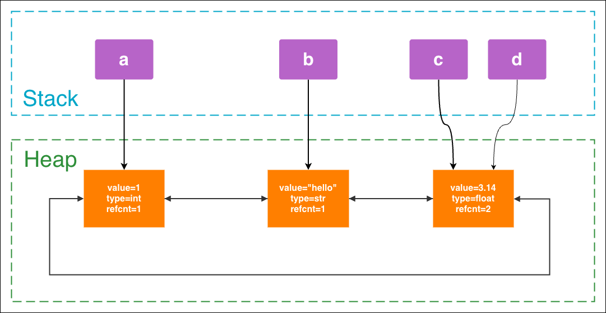

# 引用计数（reference counting）

CPython 最核心的内存管理方式是 **引用计数**：每个对象会记录当前有多少个引用指向它，当引用计数变成 0 时，对象通常可以被立即释放。

```python
a = []  # count of list is 1
b = a   # count of list is 2

del a
del b   # count of list is 0, may be collected
```

> [!NOTE]
> `del` 并不是删除对象，而是删除对象的引用（变量名和对象的绑定关系），只要对象的reference counting不为0，那么对象就依然存在。

---

# 底层模型

Python 的任何类型都是class，都是变量引用。

所以实际上都是在堆上分配空间存储内容，然后栈上保存变量去引用该空间。

在堆上，实际上保存的是一个类似**双向链表**的东西：
```c
typedef struct _object {
    struct _object *_ob_next;   // 后向指针
    struct _object *_ob_prev;   // 前向指针
    Py_ssize_t ob_refcnt;       // ref count
    PyTypeObject *ob_type;
} PyObject;
```

比如下面的代码会产生如下的堆栈分配情况：
```py
a = 1
b = "hello"
c = 3.14
d = c
```


---

# Garbage Collector

引用计数有个经典问题：**循环引用**：

```python
a = []
b = []
a.append(b)
b.append(a)

del a
del b   # 底层对象仍然是互相引用，计数器不为0，但是又没法访问
```

Python 的 GC 会定期扫描对象图，找出“虽然互相引用，但整体已不可达”的对象，然后回收。

---

# 弱引用 `weakref`

弱引用不会增加对象的引用计数“拥有关系”，可以用于：
- 缓存
- 观察对象而不阻止其回收
- 避免某些场景的强引用循环

有点类似C++中的`std::weak_prt<>`。

---

# 内存泄漏

虽然 Python 有 GC，但仍可能出现“内存不断增长”的问题。

## Python 里的“内存泄漏”到底是什么意思

在 C++ 里，内存泄漏通常指：

> 一块内存已经没用了，但程序也没有办法再释放它。

而在 Python 里，很多时候说“内存泄漏”，更准确地说是：

> 对象不再被需要了，但是**还能被程序访问到**（引用链上一直持有引用），导致它迟迟不能被回收，内存占用持续增长。

所以 Python 里的“内存泄漏”经常分成两类：

- **逻辑上的泄漏**：对象本来应该被释放，但被容器、缓存、闭包、全局变量等一直引用着
- **真正的泄漏**：底层 C 扩展、解释器 bug、第三方库 bug 导致内存真的丢失，Python 层也管不到

## 常见原因

### 容器持续持有引用

最常见的情况就是：

- `list` 不断 `append`
- `dict` 不断塞新数据
- `set` 不断变大
- 某个长生命周期对象一直把历史数据留着

```py
cache = []

def process(data):
    result = do_something(data)
    cache.append(result)  # 永远不清理
```

这里不是 GC 失效，而是 `cache` 一直活着，所以里面的对象当然也一直活着。

### 全局缓存不清理

比如：

```py
user_cache = {}

def get_user(user_id):
    if user_id not in user_cache:
        user_cache[user_id] = load_user(user_id)
    return user_cache[user_id]
```

如果 key 不断变多，又没有过期策略，这种缓存就会无限增长。

所以缓存本身不等于泄漏，但：

- 没有上限
- 没有淘汰策略
- 生命周期和进程一样长

就很容易表现得像内存泄漏。

### 闭包 / 回调意外持有大对象

```py
def make_handler(big_data):
    def handler():
        return len(big_data)
    return handler
```

只要 `handler` 还活着，`big_data` 就会一直被闭包引用住。

这类问题比较隐蔽，因为你可能以为自己只留下了一个“小函数”，实际上顺带把一个很大的对象也留下了。

### 循环引用

循环引用本身不一定有问题，因为 Python 的 GC 会处理很多这种情况。

但它仍然值得警惕，尤其是对象关系复杂时：

```py
class A:
    pass

class B:
    pass

a = A()
b = B()
a.b = b
b.a = a
```

如果这类对象很多，又夹杂复杂生命周期逻辑，排查起来会比较麻烦。

### 线程 / 协程 / 队列积压

- 工作线程消费不过来，`queue` 越堆越多
- `asyncio` 任务创建太多，没有及时结束
- 大量 `Future` / `Task` 被列表保存着

这类问题有时不是严格意义上的泄漏，而是 **in-flight 数据过多**，但现象上就是内存持续上涨。

### C 扩展层面的泄漏

这是更“纯正”的内存泄漏。
- 第三方 C 扩展没有正确释放内存
- 某些 native 库持有资源但不归还
- Python 对象已经没了，但底层申请的内存还在

这种情况单靠 Python 层代码往往很难彻底解决。

## 怎么判断是不是泄漏

* 看对象数是否持续增长：如果某类对象数量一直只增不减，往往说明被谁引用住了
* 看增长是否和请求量、任务量一致
* 看“应该短命的对象”有没有变成长命
