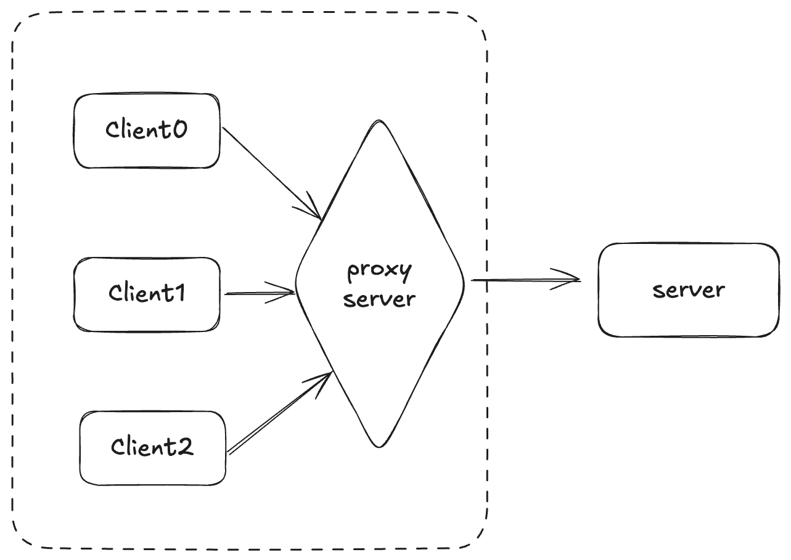
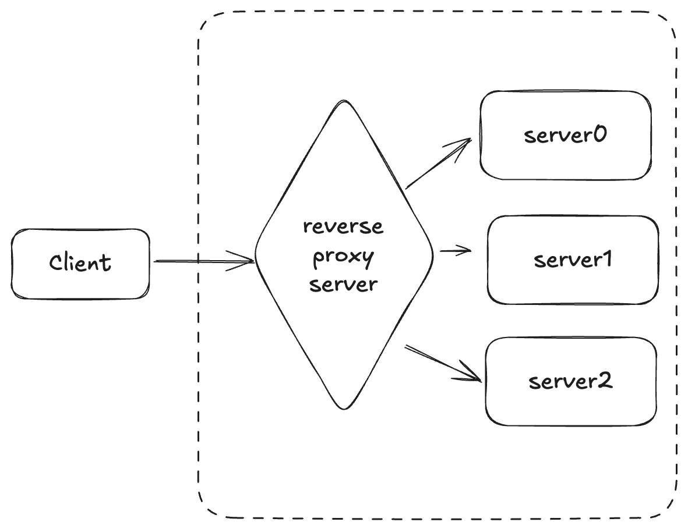

# Nginx

Nginx是一个高性能的网页服务器、反向代理服务器和负载均衡器，常用于提高网站性能和处理静态文件.

当我们在浏览器输入网址`http://www.domain.com`的时候, DNS会解析该域名为IP地址和端口, 所以相当于请求的是`http://192.0.0.1:80`. 当我们有很多用户访问该网站时, `192.0.0.1`的`80`端口会异常繁忙, 如果能把这些请求分散到多个不同的服务器/同一服务器的不同端口该有多好. Nginx正好可以解决这些问题.

## 什么是正向代理和反向代理

### 正向代理

正向代理的代理人是客户端, 即客户端请求代理帮忙联系服务端. 客户端将请求发送给正向代理, 然后由代理服务器将请求转发给目标服务器; 反之亦然. 


正向代理有以下一些特点:
1. 突破网络限制: 客户端无法直接访问服务端, 需要代理服务器帮忙
2. 网络安全: 可以隐藏客户端的真实IP
3. 访问控制: 通过给代理服务器配置, 实现控制客户端是否可以请求服务器
4. 资源缓存: 如果代理服务器缓存了客户端请求的内容, 即可直接返回, 无需代理发送网络请求

### 反向代理
反向代理的代理人是服务端, 即服务端请求代理帮忙处理和分发请求. 客户端将请求发送给反向代理, 然后由代理服务器根据一定的规则将请求转发给后端服务器. 后端服务器将响应返回给代理服务器, 再由代理服务器将响应转发给客户端.



反向代理有以下一些特点:
1. 负载均衡: 反向代理收到请求后根据负载情况, 动态分配给某一个服务端
2. 资源缓存: 可以缓存静态资源, 减少服务端负载, 如CDN(Content Delivery Network)
3. 网络安全: 隐藏服务端的真实IP, 减少网络攻击; 同时还可实现SSL加密, 访问控制等

> CDN: 当用户访问网站时, 网站服务器需要通过互联网传递数据. 如果网站的资源存储在靠近用户的CDN服务器上, 就可以减少数据传输的时间.

## Nginx 反向代理

**conf/nginx.conf**
```conf
http {
    # application运行在127.0.0.1(即localhost)的8080端口
    upstream local_server{
        server 127.0.0.1:8080;
    }

    server {
        # nginx服务器对外监听80端口
        listen       80;

        # 使用www.domain.com访问
        server_name  www.domain.com;

        # 反向代理的路径
        location / {
            proxy_pass http://local_server;
        }
    }
}
```
通过以上设置, 用户访问`http://www.domain.com`会请求`192.0.0.1:80`, 而nginx服务器会反向代理到`localhost:8080`.

## Nginx 负载均衡
**conf/nginx.conf**
```conf
http {
    # application运行在下面这些服务器的端口
    upstream load_balance_server {
        server 192.0.0.1:8080;
        server 192.0.0.2:8080;
        server 192.0.0.3:8080;
    }

    server {
        # nginx服务器对外监听80端口
        listen       80;

        # 使用www.domain.com访问
        server_name  www.domain.com;

        # 负载均衡到可用的服务器
        location / {
            proxy_pass http://load_balance_server;
        }
    }
}
```
通过以上设置, 用户访问`http://www.domain.com`会请求`192.0.0.1:80`, 而nginx服务器会反向代理到`load_balance_server`, 又因为其定义了多个可能的服务器, 所以nginx会使用该服务器组进行负载均衡.

### 负载均衡策略
#### 轮询
依次分配到各个服务器.
```conf
upstream load_balance_server {
    server 192.0.0.1:8080;
    server 192.0.0.2:8080;
    server 192.0.0.3:8080;
}
```

#### 加权
权重越高越容易分配, 性能好的服务器应适当加大权重值.
```conf
upstream load_balance_server {
    server 192.0.0.1:8080 weight=1; 
    server 192.0.0.2:8080 weight=2;
    server 192.0.0.3:8080 weight=3;
}
```

#### ip hash
相同ip会分配到同一个服务器, 可以保证同一用户的会话粘性(session).
```conf
upstream load_balance_server {
    ip_hash;
    server 192.0.0.1:8080;
    server 192.0.0.2:8080;
    server 192.0.0.3:8080;
}
```

#### url hash
同样的url会分配到同一个服务器, 即每个服务器做特定功能/存储特定数据.
```conf
upstream load_balance_server {
    hash $request_uri;
    server 192.0.0.1:8080;
    server 192.0.0.2:8080;
    server 192.0.0.3:8080;
}
```

#### 最少链接
把请求转发给连接数最少的服务器.
```conf
upstream load_balance_server {
    least_conn;
    server 192.0.0.1:8080;
    server 192.0.0.2:8080;
    server 192.0.0.3:8080;
}
```

## Nginx 多个application

假设网站有多个功能分区, 我们当然可以认为`http://www.domain.com`是base url并运行在`8080`端口, 然后所有功能都基于该base url, 通过后端框架routing到指定功能.

为了便于维护, 我们也可以把功能剥离出来作为独立的application, 那么他们不能都运行于同一个端口`8080`, 我们需要让他们运行在不同的端口. 
```
http://www.domain.com           -> http://192.0.0.1:8080
http://www.domain.com/finance   -> http://192.0.0.1:8081
http://www.domain.com/education -> http://192.0.0.1:8082
```

**conf/nginx.conf**
```conf
http {
    # base url都在8080端口
    upstream base_server {
        server 192.0.0.1:8080;
        server 192.0.0.2:8080;
        server 192.0.0.3:8080;
    }
    # finance都在8081端口
    upstream finance_server {
        server 192.0.0.1:8081;
        server 192.0.0.2:8081;
        server 192.0.0.3:8081;
    }
    # education都在8082端口
    upstream education_server {
        server 192.0.0.1:8082;
        server 192.0.0.2:8082;
        server 192.0.0.3:8082;
    }

    server {
        listen       80;
        server_name  www.domain.com;

        location / {
            proxy_pass http://base_server;
        }

        location /finance/ {
            proxy_pass http://finance_server;
        }

        location /education/ {
            proxy_pass http://education_server;
        }
    }
}
```

> ⚠️ 路径转发规则
> * `location /finance/ { proxy_pass http://finance_server; }` &rarr; 原始url会传递, 即`/finance/xxxx`
> * `location /finance/ { proxy_pass http://finance_server/; }` &rarr; 忽略前缀, 即`/xxxx`


## Nginx 静态文件

有时候输入一个网址我们希望拿到服务器上的某些静态资源, 比如图片或者视频. 比如输入`http://domain.com/animal/cat/orangecat.jpg`我们希望拿到服务器中`/home/src/jpg/orangecat.jpg`.

**conf/nginx.conf**
```conf
http {
    upstream base_server {
        server 192.0.0.1:8080;
    }

    server {
        listen       80;
        server_name  www.domain.com;

        location /animal/cat/ {
            alias /home/src/jpg;
        }
    }
}
```

> ⚠️ 注意关键词, root是添加, alias是替换. 假如url都是`http://domain.com/animal/cat/orangecat.jpg`
> * `alias` &rarr; `/home/src/jpg/orangecat.jpg`
> * `root` &rarr; `/home/src/jpg/animal/cat/orangecat.jpg`
