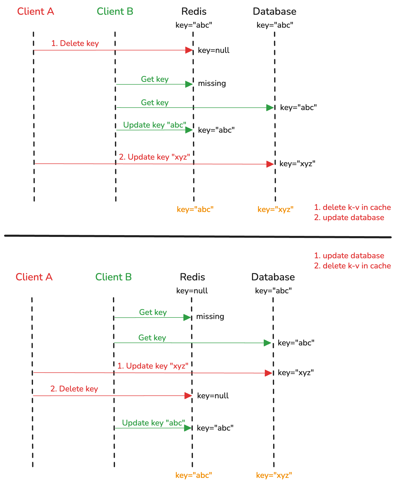
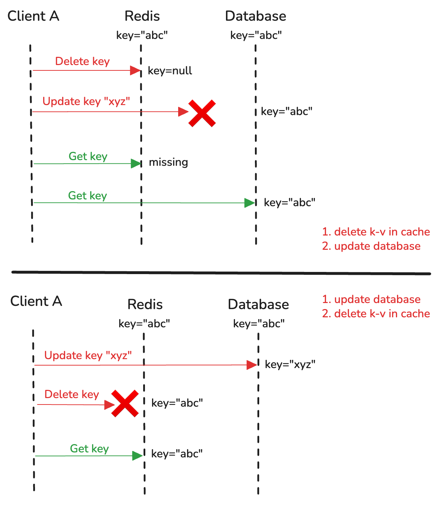

# 数据一致性

当使用读写缓存的时候, 如果使用同步写回, 那么数据一定是一致的 (使用Transaction); 如果使用异步写回, 那么一定是可能存在丢失的.

对于只读缓存, 由于我们修改的时候, 数据库和缓存是分开操作的, 这两个操作有**先后顺序**且每一步都可能**出错故障**, 所以可能存在**缓存和数据库数据不一致**或者**更新后仍然读到旧值**的情况.

**先后顺序**

下图表现出不论是"先删除缓存再更新数据库"还是"先更新数据库再删除缓存", 当多个线程运行的时候可能会遇到数据不一致的情况.



> A线程执行`UPDATE`而B线程执行`GET`, 然而缓存和数据库数据不一致

> [!NOTE]
> 上半图的解决办法是[延时双删](#延迟双删).
> 
> Client B因为缓存未命中从而到数据库获取了旧值, 并把旧值放入了缓存中. 如果不再次删除将会导致缓存里是旧值.
> 
> 延迟双删保证Client A更新完数据库后再次清空缓存, 这样过程中 (*Client A删除缓存后, 更新数据库完成前*) 错误缓存的旧值都会被清空.

**出错故障**

下图表现不论是"先删除缓存再更新数据库"还是"先更新数据库再删除缓存", 当某个步骤失败故障的时候可能会遇到更新后仍拿到旧值的情况.



> 先执行`UPDATE key "xyz"`, 然后执行`GET key`, 但是拿到的还是旧值

# 解决数据不一致

## 重试机制

把要删除的缓存值或者是要更新的数据库值暂存到消息队列中. 当应用没有能够成功地删除缓存或者是更新数据库时, 可以从消息队列中重新读取这些值, 然后再次进行删除或更新.
* 成功操作 &rarr; 把这些值从消息队列中去除, 以免重复操作
* 失败重试 &rarr; 如果重试超过的一定次数, 则发送失败信息

## 延迟双删

当选择"先删除缓存, 再更新数据库"的方法时, 线程可以在更新完成后等待一段时间再次删除缓存.

详情参考"先后顺序"中的第一张图的上半.

该方法的问题就是无法预知要等待的时长.

```
redis.delKey(X)
db.update(X)
Thread.sleep(N)
redis.delKey(X)
```

# 总结

<table>
    <tr>
        <td>操作顺序</td> 
        <td>有无并发</td> 
        <td>问题</td>
        <td>现象</td>
        <td>解决办法</td>
   </tr>
    <tr>
        <td rowspan="2">先删除缓存</br>再更新数据库</td>    
        <td>🈚️</td>  
        <td>✅ 删除缓存</br>❌ 更新数据库</td>
        <td>旧值</td>
        <td>🔁 更新数据库</td>
    </tr>
    <tr>  
        <td>🈶</td>  
        <td>缓存删除后数据库更新前, 有并发读写</td>
        <td>并发请求读到数据库旧值, 并把旧值放到缓存</td>
        <td>延迟双删</td>
    </tr>
    <tr>
        <td rowspan="2">先更新数据库</br>再删除缓存</td>    
        <td>🈚️</td>  
        <td>✅ 更新数据库</br>❌ 删除缓存</td>
        <td>旧值</td>
        <td>🔁 删除缓存</td>
    </tr>
    <tr>  
        <td>🈶</td>  
        <td>更新数据库后删除缓存前有并发读写</td>
        <td>并发请求读到缓存旧值</td>
        <td>较少出现, 因为缓存操作远快于数据库操作, 当更新完成后应该能很快删除缓存</td>
    </tr>
</table>
