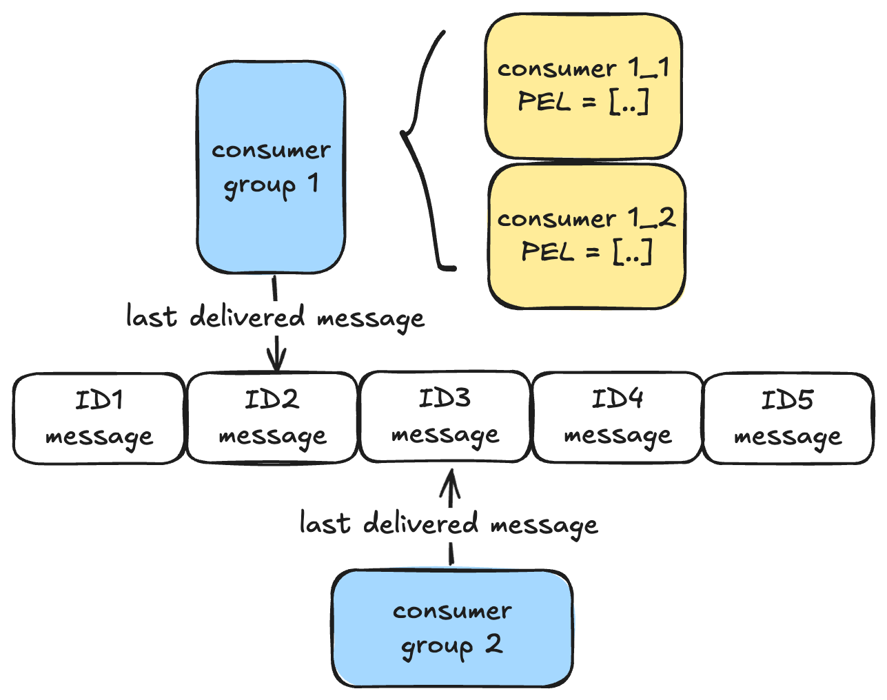

# String

Redis的string是***SDS(Simple Dynamic String)***, 它通过存储字符串长度来标明结束位置, 而不是通过判断`\0`等方式.

```
buffer => ['R', 'e', 'd', 'i', 's', '\0', '', '']
len => 5
free => 3
```
`len`标记内容长度, `free`标记可使用的剩余空间, `buffer`是预先分配的内存空间.

## 应用场景

### 计数器
因为单线程原子操作, 所以可以直接使用int类型来保存数据.

### 分布式锁
可以实现只有key不存在的时候才设置value, 所以相当于:
* key存在说明不能插入, 因为锁被hold
* key不存在说明可以插入, 因为锁没有被hold

### 共享session信息
用户登陆的时候可能会访问不同的服务器, 如果把session信息放在服务器, 就会导致可能丢失session信息. 如果将session信息放在redis, 无论哪个服务器都将访问redis获取session信息.

---

# Hash

用于存储Object, 本身其value就是一个新的key-value pair.

当元素个数较小且元素本身不大的时候, 使用ZipList存储; 否则使用HashTable存储. 这两个数据结构将会在下一篇详细介绍.

## 应用场景

当我们想要保存一个对象的时候, 我们有多种方法
1. 使用String, 其key为单独的属性
2. 使用String, 其value为序列化字符串
3. 使用Hash

```
# method1
SET user:1:name tom
SET user:1:age 18

# method2
SET user:1 "{name: tom, age: 18}"

# method3
HMSET user:1 name tom age 18
```
方法一的key过多, 内存效率低, 且key之间没有关联性.
方法二适合只读内容, 不然每次更新都需要序列化/反序列化.
方法三最直观, 但是底层数据结构可能耗费更多内存, 并且存在切换底层数据结构的损耗.

---

# List

支持双向插入删除, 底层是双向链表(Double LinkedList)或者压缩列表(ZipList). 最新版本下使用QuickList代替这两种数据结构.

和Hash类似, 当数据量小的时候使用ZipList, 否则是Double LinkedList.

## 应用场景

### 消息队列
消息队列需要保证三大特性:
1. 消息有序 &rarr; 一端插入一端弹出
2. 处理重复消息 &rarr; 生产者本身需要包含全局消息ID, 消费者需要记录已处理的消息ID
3. 消息可靠性 &rarr; `BRPOPLPUSH`会让消费者拿取消息后不会立即删除消息, 而是转存到一个备份List以供重新读取

但是问题也非常明显, List的消息每个只能弹出一次, 无法满足多个消费者的情况.


---

# Set
类似Python中的set, 无序保存不重复值.

---

# Sorted Set (ZSet)
对比Set, 每个值多了一个score, 并且元素按照score进行排序. 其实现是ZipList或跳表(SkipList).

---

# Bitmap

一串01数组, 通过偏移量定位元素. 底层结构是String.

## 应用场景

bitmap常用于记录用户登陆情况, 签到统计等信息.

---

# HyperLogLog
HyperLogLog是用来做基数统计的算法
* ✅ &rarr; 在输入元素的数量或者体积非常非常大时, 计算基数所需的空间总是固定的, 并且是很小的, 所以空间效率很高
* ❌ &rarr; 统计规则是基于概率完成的, 不是非常准确, 且只统计基数, 并不能访问数据本身
> [!NOTE]
> 基数统计: 比如`nums=[1, 2, 3, 4, 2, 3, 1, 5]`, 那么基数就是`(1, 2, 3, 4, 5)`.

## 应用场景
统计某个网页独立用户的访问量, 我们只需把用户id统统输入, 然后返回基数统计, 虽然可能有误差, 但是当量级十分巨大的时候可以忽视误差. (比如百万级别点击量, 我们并不在乎百万以下的差别)

---

# Stream

Stream用于实现消息队列. Redis本身能够实现pub/sub, 但是因为不能持久化, 所以会出现宕机后消息丢失. 如果用List来模拟消息队列, 又会出现每个消息只能被consume一次, 无法服务多个消费者.

> [!NOTE]
> Redis自带的pub/sub
> 1. 无法把消息RDB或AOF持久化到磁盘, 因此宕机后会清空
> 2. 其不具备ack功能, 不保证消费者一定能consume消息, 属于是“发后即忘, 不管售后”
> 3. 消息积压后会直接选择断开连接

为了解决这些问题, Stream有以下的特点
1. 类似List, 可以保证消息顺序
2. 创建消息时自动生成全局ID
3. 支持消费组
4. 支持ack机制, 未收到ack的时候消息保存在***PEL(Pending Entries List)***以供消费者consume失败后retry



多个consumer group可以使用同一个message, 但是同一个message最多只会被group中某一个consumer使用, 即某个消费组中任意一个消费者读取了消息都会使消费组的游标往前移动.

## Stream vs 其他消息队列
与Kafka这种基于磁盘的专业消息队列相比, redis有以下几个缺点:
1. 消息可能会丢失 &rarr; redis是基于内存, 即使有持久化手段, 但是仍然可能在过程中丢失
2. 消息堆积 &rarr; redis是基于内存, 所以队列不可能无限, 在达到上限的时候会清除旧的message