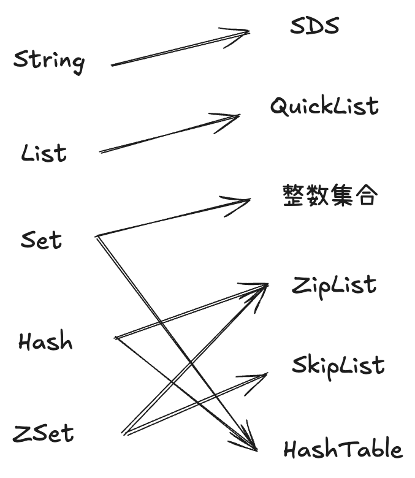
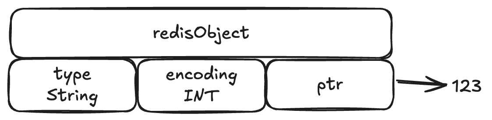
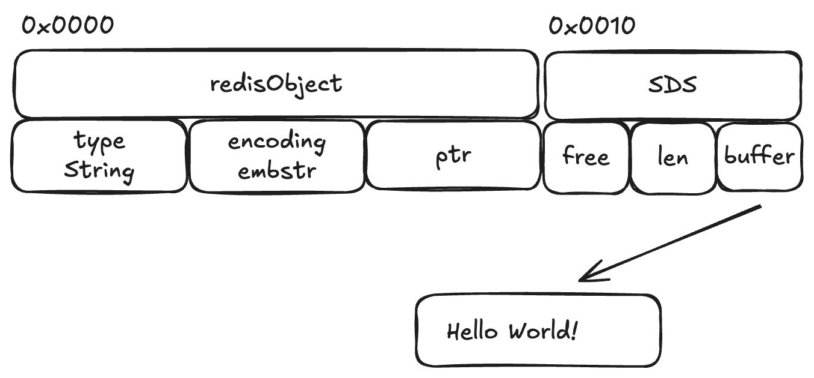
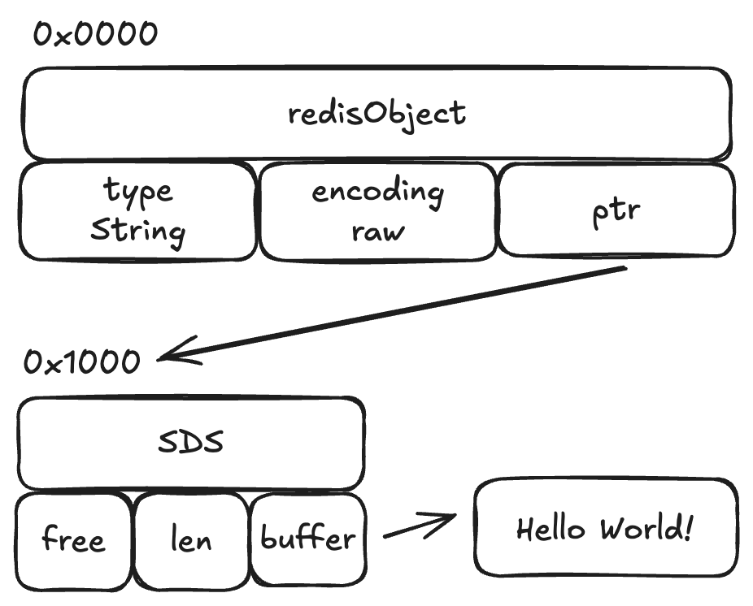

# 映射关系

较新版本中ZipList被ListPack淘汰, 但是本质上类似.

# SDS (Simple Dynamic String)

## 特点
1. O(1)获得长度信息
2. 避免溢出 &rarr; 1MB以下double扩容, 1mb以上每次扩容1MB
3. 二进制安全(Binary Safe) &rarr; 以数组长度而不是`\0`决定终止位置, 可以存储更复杂的内容
4. 惰性空间回收(Lazy Space Reclamation) &rarr; string变短时不会马上回收已分配空间, 而是跟踪free的区域以便于后续再次扩容

## 底层实现

字符串可以保存三种类型: int, embstr和raw.

如果是int, 那么会直接把该值放到redisObject的`ptr`属性中.

如果是较短的字符串, 那么redisObject和SDS将会通过一次内存分配函数来分配一块连续的内存空间.

如果是较长的字符串, 那么redisObject和SDS将会通过两次内存分配.

其优缺点如下:
1. embstr可以减少分配和回收的次数, 同时因为是连续内存空间所以效率更高.
2. 因为其连续内存空间, 所以实际上可以认为是**只读**字符串, 当需要扩容时需要变成raw再操作.

---

# ZipList / ListPack

---

# HashTable

---

# QuickList

---

# SkipList

