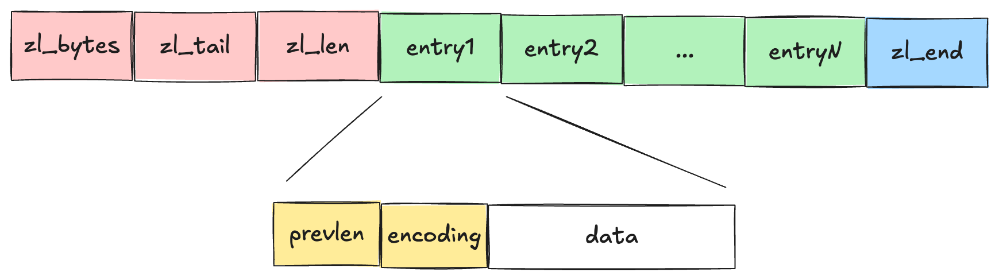

# 映射关系


较新版本中ZipList被ListPack淘汰, LinkedList被QuickList淘汰.

# SDS (Simple Dynamic String)

## 特点
1. O(1)获得长度信息
2. 避免溢出 &rarr; 1MB以下double扩容, 1mb以上每次扩容1MB
3. 二进制安全(Binary Safe) &rarr; 以数组长度而不是`\0`决定终止位置, 可以存储更复杂的内容
4. 惰性空间回收(Lazy Space Reclamation) &rarr; string变短时不会马上回收已分配空间, 而是跟踪free的区域以便于后续再次扩容

## 底层实现

字符串可以保存三种类型: int, embstr和raw.

如果是int, 那么会直接把该值放到redisObject的`ptr`属性中.


如果是较短的字符串, 那么redisObject和SDS将会通过一次内存分配函数来分配一块连续的内存空间.


如果是较长的字符串, 那么redisObject和SDS将会通过两次内存分配.


其优缺点如下:
1. embstr可以减少分配和回收的次数, 同时因为是连续内存空间所以效率更高.
2. 因为其连续内存空间, 所以实际上可以认为是**只读**字符串, 当需要扩容时需要变成raw再操作.

---

# LinkedList

List底层是双向链表.
```c
typedef struct ListNode {
  struct ListNode* prev;
  struct ListNode* next;
  void* value; 
} ListNode;

typedef struct List {
  ListNode* head;
  ListNode* tail;
  unsigned long len;
  // other functions like: free, dup, match
} List;
```
| 优点 | 缺点 |
| :---: | :---: |
| 获取前后节点是O(1) | 链表节点内存不连续 |
| 获取总长度是O(1) | 每个节点都需要额外空间分配 |
| 访问头尾是O(1) | |
| `void *`保存value, 节点实际上可以是任何类型 | |

---

# ZipList

压缩链表是为了节约内存, 其本质是**连续内存的顺序型数据结构**, 类似可以放不同类型的数组.

* ✅ 节省内存
* ❌ 查询, 插入, 修改元素的时候效率低下

本质上相当于用时间换空间, 所以只适合元素数量不多或者数据本身简单的情况.


* `zlbytes` &rarr; 整个列表的内存字节数
* `zltail` &rarr; 列表尾的偏移量
* `zllen` &rarr; 节点个数
* `zlend` &rarr; 标记列表结束

当我们查找元素的时候, 除了头尾能O(1)算出偏移量, 剩下的都必须遍历O(N).

其中每一个entry又有三个属性, 其中`prevlen`和`encoding`所占用的空间大小是取决于节点的大小
1. `prevlen` &rarr; 前面节点的长度, 便于从后往前遍历, 其占用内存空间大小取决于前一个节点的长度<sup>[*]</sup>
2. `encoding` &rarr; 数据类型和长度
3. `data` &rarr; 数据本身

> 前一个节点的大小超过某个threshold时, prevlen所占用的内存空间将会变大

## 连锁更新

压缩链表在插入和修改元素的时候, 空间不够需要重新分配空间.

假设每个节点的`prevlen`都在一个临界值, 即正好每个节点都处在threshold边缘
1. 在当前节点前面插入一个新的节点, 该节点大小超过threshold
2. 新节点会导致当前节点的`prevlen`占用空间变化
3. 当前节点`prevlen`占用的空间变大, 导致当前节点大小超过threshold
4. 后一个节点的`prevlen`变大, 重复该过程, 最后像多米诺骨牌一样引起多个变化

---

# QuickList

QuickList本质上是一个双向链表 + ZipList.

由于ZipList的问题在于数据量大的时候容易出现连锁更新, 所以QuickList通过控制每个ZipList的大小来尽可能规避连锁更新带来的损失. 即当插入新元素的时候, 如果当前ZipList已经有足够多数据, 则新建一个新的ZipList作为链表节点, 然后插入元素.


---

# Listpack


ZipList最大的问题就是因为保存了前一个节点的大小, 所以导致会有连锁更新问题. 而Listpack中的`len`属性只记录当前节点的大小, 所以更新的时候不再会有连锁的问题.

---

# HashTable

Redis的哈希表结构如下
```c
typedef struct HashTable {
  DictEntry **table;  // 实际上是一个指针数组, 每个元素是一个指针指向一个DictEntry
  unsigned long size;
  unsigned long mask;  // 掩码, 用来计算hash index
  unsigned long used;
} HashTable;

typedef struct DictEntry {
  void *key;
  union {
    void* val;
    int i_num;
    double d_num;
  } value;  // union, 如果是对象则void*, 如果是常量则不用分配额外空间
  DictEntry *next;  // 链式哈希, 解决哈希冲突
} DictEntry
```
## 哈希冲突

### 链式哈希
哈希数组中每个元素是一个链表, 如果发生冲突则append到链表中. 该方法简单, 但缺点是当冲突较大时时间复杂度接近O(N).

### rehash
即对哈希数组进行扩容, 具体操作是:
1. 在结构体中存两个哈希表`table1`和`table2`, `table1`用来记录数据`table2`为空
2. 当rehash的时候, `table2`在`table1`基础上扩容
3. `table1`的数据rehash到`table2`, 使用`table2`记录数据
4. `table1`空间释放`table2`当作新的`table1`来使用

缺点在于第3步可能涉及非常大的数据拷贝, 阻塞redis无法响应其他请求.

### 渐进rehash
同样是两个hashtable，区别在于并不一次性把`table1`迁移到`table2`，而是每次增删查改的时候把对应索引的内容迁移, 直到table1为空.

1. 查/删/改 &rarr; 先查`table1`, 如果索引处有内容则迁移并执行; 如果没内容则查`table2`
2. 增 &rarr; 只写`table2`

> [!IMPORTANT]
> rehash触发条件 &rarr; `负载因子 = 哈希表节点数 / 哈希表大小`
> 
> 当负载因子大于1的时候, 只要没有在持久化就会rehash; 当负载因子大于5的时候强制rehash.

---

# SkipList

跳表的平均**查找和插入效率为O(logN)**.

实际上`zset`包含了哈希表和跳表, 支持高效的**范围查找**和**单点查找**. 在插入时会更新哈希表和跳表, 保证数据一致.

> [!NOTE]
> 实际上哈希表的单点查找主要用于获得某个元素的权重, 绝大部分操作还是依赖跳表

```c
typedef struct zset {
  dict *dict;  // linkedlist
  zskiplist *zsl; // skiplist
} zset;

typedef struct zskiplist {
  zskiplistNode *head, *tail;
  uint_t size;
  int level;  // 跳表的最大层数
}zskiplist;

typedef struct zskiplistNode {
  void *value;
  double score;
  zskiplistNode *backward; // 指向前一个元素
  
  struct zskiplistLevel {
    zskiplistNode *forward;  // 指向当前层级的下一个node
    uint_t span;  // 当前节点通过层级访问下一节点时跨过的节点数
  } level[];
}zskiplistNode;
```
其中最特殊的是`zskiplistNode`中的`level[]`数组, 其每个元素代表每个层级, 如`level[0]`代表第一层, `level[1]`代表第二层.


## 跳表查询过程
跳表会从最高层开始, 因为最高层的跨度最大, 能快速定位. 如果`下一个节点权重<目标权重`, 则forward到下一个节点并继续比较. 如果`下一个节点权重>目标权重`, 则降级到下一个层级并继续比较.

## 跳表插入过程

层级数很大程度影响了查询效率, 你可以想象到最优的情况是类似金字塔一样的形状. 根据研究, 最理想的情况是**相邻层节点数比例2:1**.

但是如果每次插入或者删除节点就调整层数会带来很多额外开销.

Redis采用一种伪最优解的办法: 创建节点的时候**随机生成层数**.

> [!NOTE]
> 具体操作是, 每创建一个节点的时候产生一个[0, 1]的随机数, 如果数字<0.25则生成一个层级并继续随机, 直到数字>=0.25结束. 这保证了层数越高, 概率越低.
> 
> 第一层默认生成, 第二层概率为0.25, 第三层为0.25^2, 第n层为0.25^(n-1).


## 为什么不使用平衡树等数据结构

* 内存上更紧凑 &rarr; 平衡树每个节点包含两个指针, 而跳表平均每个节点包含的指针数更小
* 更适合范围查找 &rarr; 在平衡树中找到小值之后需要中序遍历到大值, 而跳表找到小值后简单遍历即可
* 实现更加简单 &rarr; 平衡树的插入和删除涉及重新调整树结构, 跳表只涉及指针更改

---

# 整数集合

整数集合是一段连续的内存空间, 其定义如下

```c
typedef struct intset {
  uint32_t encoding;
  uint32_t length;
  int8_t contents[];
} intset;
```
contents数组存储内容取决于encoding, 比如`encoding=INT_16`那么就存`int16_t`.


## 升级
当新插入元素比当前集合类型更高(比如插入INT_16到INT_8数组), 数组会自动升级. 该过程并不会新建一个新类型数组, 而是在已有基础上扩容, 从而节省空间.


> [!IMPORTANT]
> 整数集合只能升级不能降级.