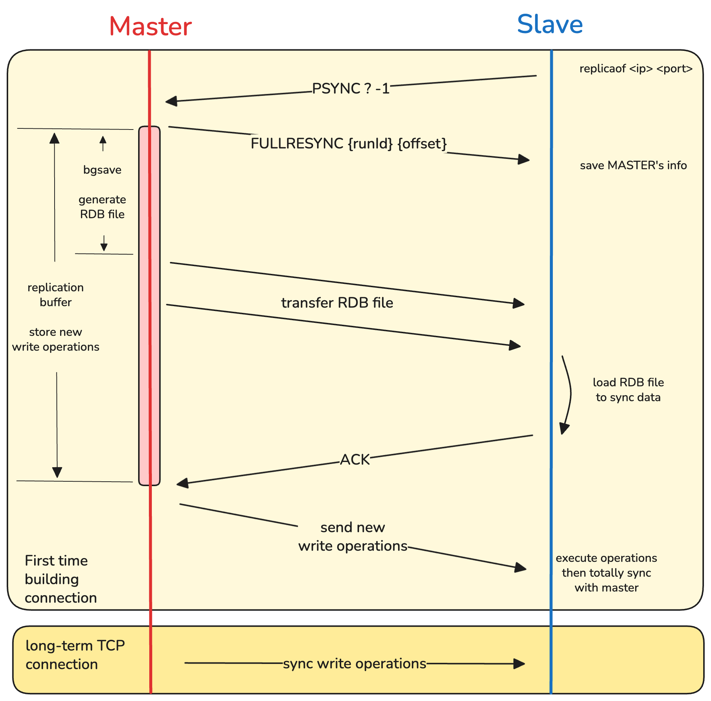

# 主从复制

服务器被分为主机和从机:
* 主机 &rarr; 支持客户端读写操作, 并不断的向从机发送写同步
* 从机 &rarr; 只支持客户端读操作, 并不断接受主机的写同步


其中写同步是用于将主机中新写入的内容同步到从机, 从而保证客户端能够读取到新鲜的数据.

## 过程



整体流程图如上.
　
**1. 建立连接**

```
// 在从机上
replicaof <主机IP> <主机port>
```

从机发送`psync {runId} {offset}`表明请求数据同步:
* `runId` &rarr; 服务器的随机uuid, 由于第一次链接时不知道主机uuid, 所以使用"?"
* `offset` &rarr; 复制进度, 第一次链接时为-1, 详细作用请参考[增量复制](#增量复制)

主机收到`psync`后返回`FULLRESYNC {runId} {offset}`表明进行**全量复制**数据.
* `runId` &rarr; 主机uuid
* `offset` &rarr; 主机当前的复制进度, 详细作用请参考[增量复制](#增量复制)

**2. 主机同步数据到从机**

主机使用`bgsave`来`fork()`进程去生成RDB snapshot. 然后发送该RDB文件让从机进行数据载入.

> [!NOTE]
> 由于`bgsave`, 传输RDB, 从机加载RDB都需要时间, 此时主进程可能响应了一些新的写操作, 所以主进程会将这些新的写操作写入**replica buffer**.

当从机加载完RDB后返回一个ACK.

**3. 主机发送写步骤到从机**

主机收到ACK之后把replica buffer中写操作同步到从机, 从而实现两者同步.

**4. 长链接的TCP**

主从机在第一次建立连接之后之间保持**长链接TCP**, 每次主机收到写操作都会先改写数据, 然后通过TCP把写操作同步到从机从而实现数据一致.


## 分摊压力

在写同步的时候需要主机需要(1)生成RDB文件; (2)传输RDB文件. 当直接连接到主机的从机过多, 就会有一些问题:
1. 主机通过`bgsave`新建进程来生成RDB, 多个从机意味着要`fork()`多个进程, 会阻塞主进程
2. 大数据量的RDB文件传输到多个从机会占用主机带宽

为了解决这个问题, 我们可以设置"从机的从机", 即使用某个从机当作其他从机的主机, 这样生成和传输RDB的压力可以从主机分摊到从机.

```
// 在从机2.1上
replicaof <从机2的IP> 6379
```


# 增量复制