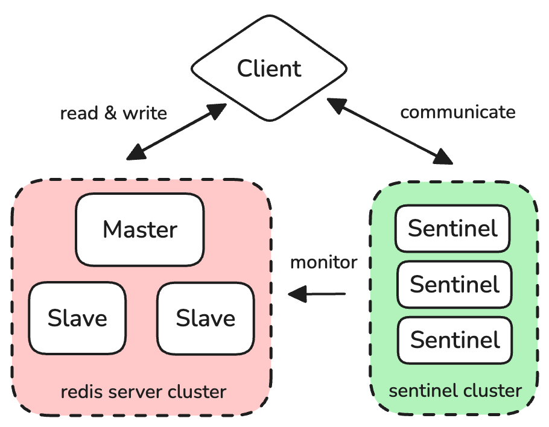

# 哨兵机制

哨兵机制相当于在**主从模式**上添加一个监管的集群. 如果主机故障, 我们需要有自动化流程去选择一个从机, 并让它成为新的主机来处理客户端请求.

在哨兵模式下, 典型的工作流程如下:
1. 客户端不会向简单的主从模式一样直接连接主机, 而是**连接哨兵**, 哨兵会告诉告知客户端当前主机的地址
2. 客户端通过**pub/sub**订阅哨兵的一些channel, 以便通过哨兵获取最新的状态信息
3. 客户端连接当前的主机并进行正常工作
4. 如果发生故障, 哨兵进行了故障转移, 选择了一个从机作为新的主机, 那么哨兵会通过channl告知客户端连接新的主机
5. 客户端连接新的主机并重复正常工作

# 如何判断故障

哨兵会间隔ping一下主从机, 如果在`down-after-milliseconds`内收到ack则认为对方正常; 否则认为对方**主观下线**.

> [!NOTE]
> 对于**主机**存在两种状态: **主观下线**和**客观下线**. 因为可能存在网络延迟或者丢包, 所以不能直接认为主机发生了故障.
> 
> 当一个哨兵发现客观下线时会发送`is-master-down-by-addr`给其他哨兵询问意见. 当集群中ack该命令认为主机下线的哨兵数量超过`quorum`时 (即大部分哨兵认为主机下线), 主机变为客观下线状态, 即主机有故障需要更换.

# 如何选择哨兵

如上所述判断故障需要一个集群进行投票, 所以哨兵模式其实是部署一个集群. 那么当大家投票同意主机主观下线后需要在从机中选择一个作为新的主机时, 应该是哪一个哨兵来执行呢?

这个过程可以参考**Raft算法**, 它可以用于leader election. 其简易流程如下:

> [!IMPORTANT]
> 只有哨兵集群使用Raft算法, 主从结构中并不需要Raft.
> 
> 因为Raft是企图在**没有外界干扰的情况下**选择主机, 而主从结构本身是有哨兵集群进行监视和辅助的, 所以并不需要Raft在各个节点之间商量, 而是直接由哨兵进行操控.

1. 每个投票认为主机主观下线的哨兵都被成为candidate, 只有candidate才有可能当leader
2. candiate随后会向其他所有哨兵广播一个消息, 企图说服他们给自己投票当leader, 同时candiate会给自己投票
3. 每个哨兵在每一轮只会投一次票支持一个人
4. 如果某个哨兵得到的票数 (1)超过半数; (2)超过quorum; 则认为当选leader, 否则进行下一轮重新投票 (每个哨兵有一个计时器, 如果指定时间内没有得到足够多票数则再次广播进行下一轮)

> [!IMPORTANT]
> `quorum`应该是一个**超过集群半数的奇数**:
> * 如果是偶数, 可能浪费很多时间选主, 比如两个candidates每次都各获得一半票数, 则需要不断重复选主
> * 如果不超过半数, 则很容易误判主机客观下线, 从而进入选主环节, 比如只有一小部分哨兵认为主观下线而大部分正常, 则因为较小的`quorum`导致进入不必要的选主环节 (客观下线只看是否超过`quorum`, 而选主需要`max(quorum, half)`)

# 如何故障转移

主从故障转移包括以下几个步骤:
1. 从主节点的从节点中选出新的主节点
2. 该从节点成功当选为主节点
3. 让其他从节点指向新的主节点
4. 将新的主节点信息通过pub/sub发送给客户端
5. 监视旧的主节点, 重新上线后由主变从

### 选出新的主节点

**Step 1. 选择优先级高的节点**

Redis的从节点可以设置优先级`slave-priority`, 比如某个从节点内存更大或者网络延迟更低则优先级更高.

**Step 2. 选择复制进度靠前的节点**

复制进度靠前即所需要复制的内容最少, 通过`master_repl_offset - slave_repl_offset`来计算. 因为缺失的内容最少所以保存的内容最多.

**Step 3: 选择ID较小的节点**

实在选不出来就根据一些特殊的属性选择,比如ID的大小等.

### 从节点成功当选新主节点

1. 哨兵向选出来的节点发送`SLAVEOF no one`命令让其断开从属关系
2. 哨兵发送`INFO`心跳获取该节点的状态
3. 哨兵得知该节点的状态从"从机"->"独立"->"主机"变化之后说明已经成功当选

### 从节点指向新主节点

向其他从节点发送`SLAVEOF <新主节点IP> <新主节点PORT>`从而让他们指向新的主节点.

### 通知客户端

客户端在连接Redis主机之前就会和哨兵进行连接从而获取当前主机的信息. 在这一次初始化连接时, 客户端会通过**pub/sub**订阅哨兵的channel. 而当新的主节点工作之后, 哨兵会将该新节点的信息通过channel告知客户端, 让其更换连接的主机.

> [!NOTE]
> 哨兵有很多channel, 能够让客户端随时查询或了解主从机的状态.

### 旧节点由主变从

当旧节点重新上线则发送`SLAVEOF`进行指向.

# 哨兵集群

哨兵集群的构建也是通过**pub/sub机制**.

**哨兵如何感知其他哨兵**

主节点有个channel叫`__sentinel__:hello`. 每次新的哨兵连接主节点时都会把自己的信息发送到这个频道并尝试获取其他哨兵的信息, 这样所有的哨兵们就互相了解, 并可以自行组网.

**哨兵如何感知主从结构拓扑**

同时由于主节点知道从节点的信息, 哨兵们间隔给主节点发送`INFO`消息来获取拓扑信息. 从而哨兵们就能够知道从节点的信息并进行监控.

> [!NOTE]
> 哨兵和主从拓扑之间存在许多的连接:
> 1. **哨兵&rarr;主从节点**: 订阅`__sentinel__:hello`来发布自身信息并获取其他哨兵的信息
> 2. **哨兵&rarr;主从节点**: 每隔10秒发送一个INFO消息来获取主从机信息
> 3. **哨兵&rarr;主从节点**: 每隔1秒发送一个PING
> 4. **哨兵&rarr;哨兵**: 每隔1秒发送一个PING
> 5. **哨兵&rarr;主节点**: 当故障转移时每隔1秒发送一个INFO消息来获取主从切换的进度
