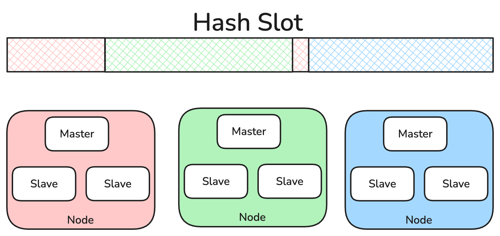
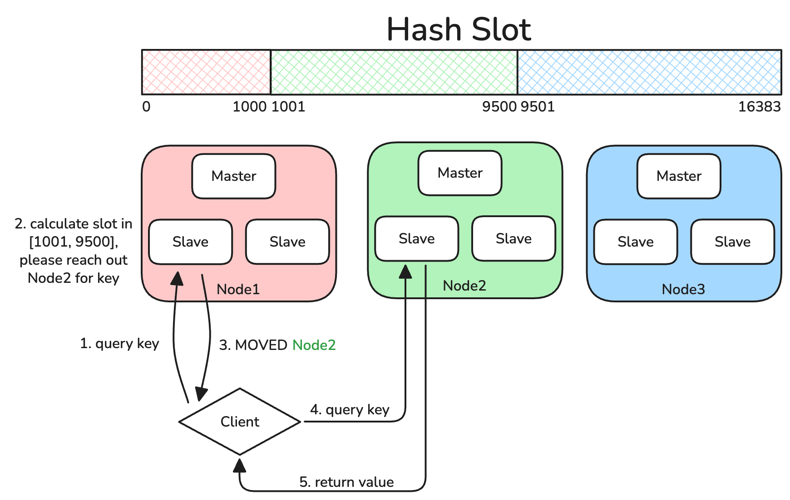
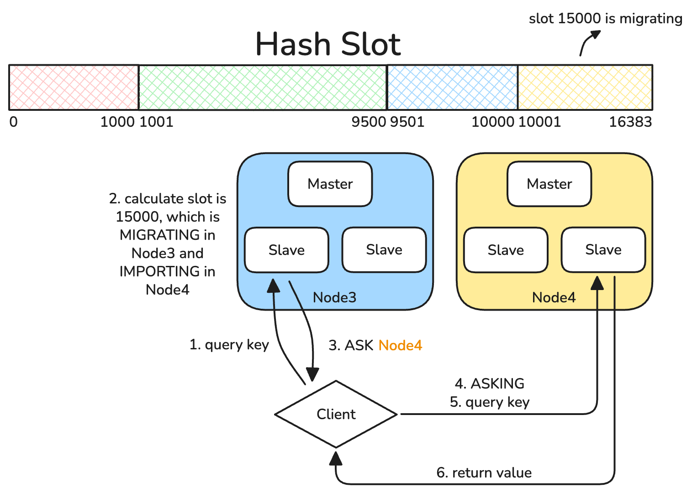

# Cluster模式

当一个分布式系统遇到性能问题的时候一般有两种解决办法:
* scale-up &rarr; 即提升单点性能
* scale-out &rarr; 即扩展多点

使用主从模式无法避免性能问题, 因为主机从机保存了所有的内容. Cluster模式提供了分片(sharding)方案, 每个机子只需要保存一部分数据即可.



# Hash Slot 哈希槽

将数据空间划分成2^14=16384个槽位, 每个节点管理部分槽. 每个进入Redis的键值对, 根据key进行散列.

> [!NOTE]
> `哈希算法 = CRC16(key) & 0x3FFF(16383)`, 此处使用 `&` 而非 `%` 的原因是 `x & (2^n - 1) == x % 2^n`

有的时候我们希望强制把某些key放到同一个节点, 此时可以通过hash tag实现. 通过在key后面加`{tag}`, 算法将不再对key进行hash, 而是对tag进行hash.
```
cluster keyslot key1{1}
cluster keyslot key2
cluster keyslot key3{1}
```

# 节点通信

因为cluster模式下没有主机从机的概念, 所以每个节点是平等的, 此时需要使用Gossip协议实现节点间通信.

> Gossip协议: 每个节点周期性选择一些节点并进行通信, 将信息广播出去. 最终会收敛, 所有人都会知道拓扑结构和状态.
> * MEET &rarr; 新节点加入
> * PING/PING &rarr; 心跳
> * FAIL &rarr; 节点下线

# 故障转移

**主观下线**

Gossip的时候给另外节点发送ping, 如果在指定时间内没有收到pong则认为该节点主观下线, 标记为`PFAIL`.

**客观下线**

在Gossip交换信息的时候, 如果超过半数节点都认为该节点主观下线`PFAIL`, 则进入客观下线流程, 并广播这个新状态.

注意, 由于Cluster无中心, 所以可以是任意一个节点广播客观下线, 只需要他满足:
* 当前维护的状态表里, 某个节点有超过半数人投票`PFAIL`
* 自己也认为某个节点`PFAIL`

**主从切换**

如果下线的是从节点则无所谓. 如果是主节点, 则进行主从切换, 其过程使用Raft, 类似哨兵的leader election.

# 扩容和收缩

Cluster最大的特色就是scale-out, 所以允许动态的增加或减少服务器.

当增加服务器的时候, 初始状态下是不管理任何slot的, 需要通过配置从其他服务器获取slot的管理权. 当减少服务器时, 也需要把slot的管理权先移交给其他服务器才能被移除.

这个slot的迁移是需要时间的, 因为一个slot中可能有很多key, 所以在迁移的过程中, 源服务器需要设置slot为`MIGRATING`, 目标服务器需要设置slot为`IMPORTING`.

# 数据访问

客户端可以连接到任意的服务器(主机或从机), 所以访问的节点可能并不直接管理所查询的key所在的slot. 这个时候就需要**重定向**.

**MOVED重定向**



如果key正好在访问的服务器所管理的slot中, 则直接返回. 否则进行如上图所示的MOVED重定向.

**ASK重定向**



如果key正好在访问的服务器所管理的slot中, 则直接返回. 如果key在一个没有迁移的slot中, 则进行MOVED重定向. 如果key所在slot在迁移中, 则进行如上图所示的ASK重定向.