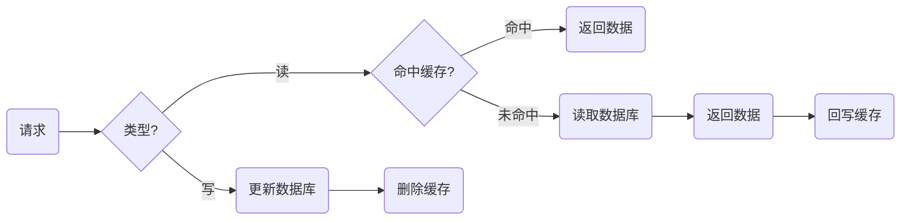
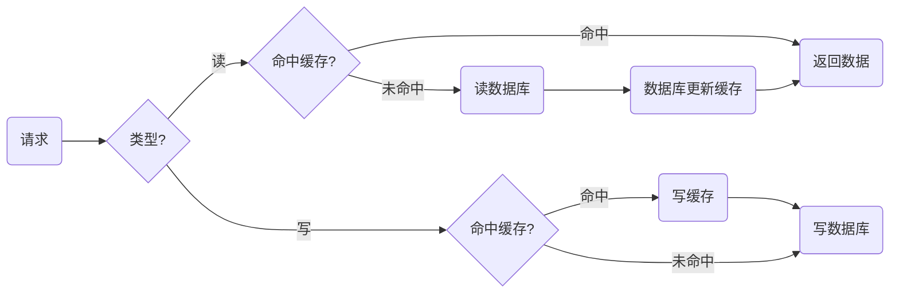
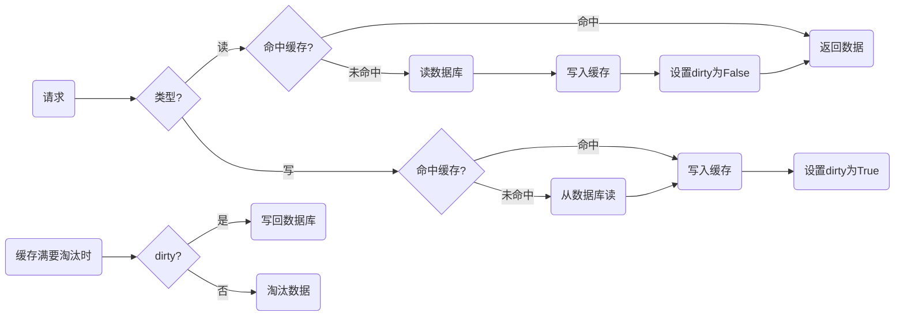

# 缓存

Redis因为保存数据在内存中, 具有较快的读写性能, 所以常被当作中间件来实现缓存, 避免频繁的磁盘读写.

## 常见缓存更新策略

### Cache Aside 旁路缓存

应用程序直接与缓存和数据库交互并负责维护.



> [!IMPORTANT]
> 写策略必须**先更新数据库再写缓存**, 顺序不能反过来, 否则读写并发的时候会出现数据不一致. 具体原因和例子可以参考[Ch10. Consistency](./10_consistency.md).

Cache Aside适合**读多写少**的场景, 因为写入频繁的时候缓存中的数据会被频繁的清理, 这样缓存命中率会受影响. 如果想考虑解决办法:
1. 更新数据时也更新缓存, 只是更新前对缓存加分布式锁, 这样只有一个线程能更新缓存, 代价就是写入性能降低
2. 更新数据时也更新缓存, 只是给缓存加较短的过期时间, 即使缓存不一致也会很快过期

### Read/Write Through 读写穿透

应用程序只和缓存交互, 然后让缓存自己和数据库交互.



### Write Back 写回

写回策略在更新数据的时候只更新缓存, 并将缓存设置为脏(dirty), 然后直接返回, 并不更新下一级存储. 只有当脏数据被替换的时候才会写回下一级存储.



该策略适合**写多**的场景, 因为写入后直接返回数据, 且只有在缓存满且数据脏(更新)的情况下才会被写回.

问题就在于数据长时间保存在缓存中不持久化, 一旦系统重启则丢失所有内容.

## 缓存类型

Redis的缓存又称作旁路缓存, 因为Redis是一个独立的系统软件, 当我们部署了Redis实例后, 如果应用程序想要使用 Redis 缓存, 我们就要在程序中增加相应的缓存操作代码. 即读取缓存, 读取数据库和更新缓存的操作都需要在应用程序中来完成.

```python
cacheKey = "..."
cacheValue = redis.get(cacheKey) # 直接读缓存

# 缓存没有命中
if cacheValue is None:
    cacheValue = db.get(cacheKey) # 访问数据库
    redis.write(cacheKey, cacheValue) # 添加到缓存
```

### 只读缓存

* READ &rarr; 先从缓存读取. 如果读到了直接返回, 否则去数据库取完之后由应用软件添加到缓存.
* WRITE &rarr; 直接写入数据库.
* UPDATE &rarr; 删除缓存数据并修改数据库数据.
* DELETE &rarr; 删除缓存数据和数据库数据.

其中增删改并不会写缓存, 当下一次应用尝试读取的时候未命中缓存自然会触发READ把数据库数据写入缓存.

### 读写缓存

在缓存中直接操作数据的增删改. 由于Redis保存数据在内存, 所以宕机会丢失数据.

由此根据数据可靠性和缓存性能, 有两种写回策略:
1. 同步写回 &rarr; 先写缓存, 然后阻塞去写数据库, 完成之后再返回值
2. 异步写回 &rarr; 先写缓存, 然后返回值, 当数据被淘汰时再写到数据库

||同步|异步|
|---|---|---|
|优点|缓存和数据库的内容一致, 数据可靠|不用写数据库, 响应快|
|缺点|需要等待缓存和数据库同步才能下一步|掉电丢失数据|

## 缓存异常
### 缓存雪崩 Cache Avalanche

当把Redis用作缓存的时候, 我们会对键值对设置过期时间. 如果键值对过期了再被访问, 就需要去数据库拿数据之后返回客户端, 再由客户端放入Redis作缓存.

如果**Redis宕机**或者**某段时间大量键值对过期**, 那么大量的用户请求将直接访问数据库造成系统压力骤增, 就像雪崩一样越来越严重.

**宕机**

1. 熔断或限流 &rarr; 熔断即暂停所有访问, 限流即限制访问数量. 通过在入口处就减少数据库的访问来避免问题的累积.
2. 构建集群 &rarr; 构建集群能够提供高可用.

**大量过期**

1. 均匀设置过期时间 &rarr; 为防止都在同一时刻过期, 可以给过期时间加上随机数.
2. 互斥锁 &rarr; 业务线程处理用户请求的时候, 如果数据不在Redis则加锁, 直到从数据库拿完数据并添加进缓存之后再释放. 其他未获得锁的线程要么等待要么返回空值.
3. 分级缓存 &rarr; 越后面级别存储内容越多, 过期时间越长.
4. 不过期 &rarr; 要么不设置过期时间, 要么是使用后台线程在快过期时续时.

### 缓存击穿 Cache Breakdown

缓存击穿一般特指hot key, 如果被频繁访问的数据过期了则数据库会受到很大压力.

1. 互斥锁
2. 不过期 &rarr; 对hot key要么不设置过期时间, 要么是使用后台线程在快过期时续时.

### 缓存穿透 Cache Penetration

大量访问的数据既不在缓存也不在数据库, 也就是说缓存永远无法被建立, 所有请求都必定会访问数据库.

1. 限制请求 &rarr; 将恶意攻击的请求拦截, 比如在入口处检查是否含有恶意字段或者违反规定.
2. 缓存空值 &rarr; 既然数据不存在返回空值, 那么我们就创建一个`key: null`的键值对放入缓存.
3. 布隆过滤器 &rarr; 缓存没找到数据准备访问数据库前, 使用过滤器进行判断, 如果数据也不在数据库则不用访问.

> [!NOTE]
> 布隆过滤器由两部分组成: (1) 初始值全为0的bitmap; (2) N个不同的hash方法.
>
> 当放入一个值的时候:
> 1. 用N个hash方法得到N个输出
> 2. 将N个输出对bitmap长度取模
> 3. 将对应位置设置为1
>
> 这样当查询一个值的时候:
> 1. 用N个hash方法得到N个输出
> 2. 将N个输出对bitmap长度取模
> 3. 如果对应位置有任意一个为0, 则数据不存在
>
> 布隆过滤器的特点就是: **位图对应的不一定存在, 但位图不对应的一定不存在**.

### 对比
|雪崩|击穿|穿透|
|---|---|---|
|同时访问多个不同的数据|同时访问一个热点数据|访问的数据不存在|
|侧重于"崩", 即面广|侧重于"穿", 集中一个点|侧重于"透", 即缓存和数据库|
