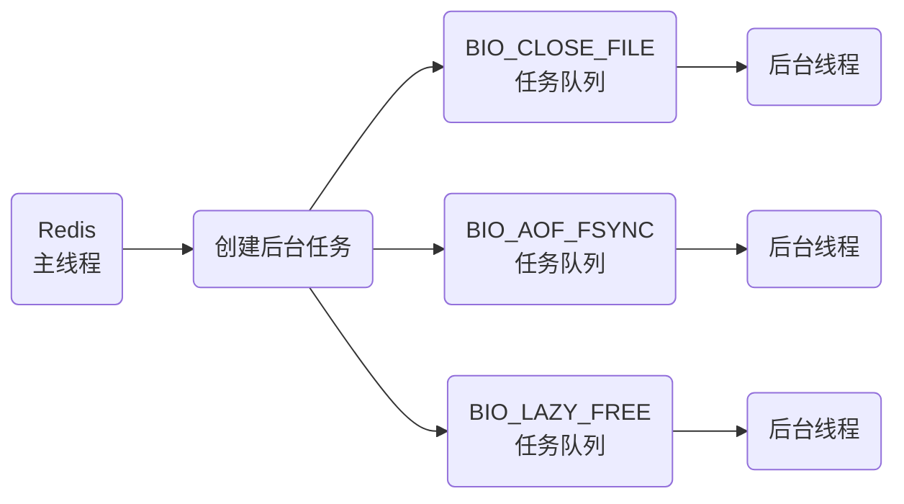
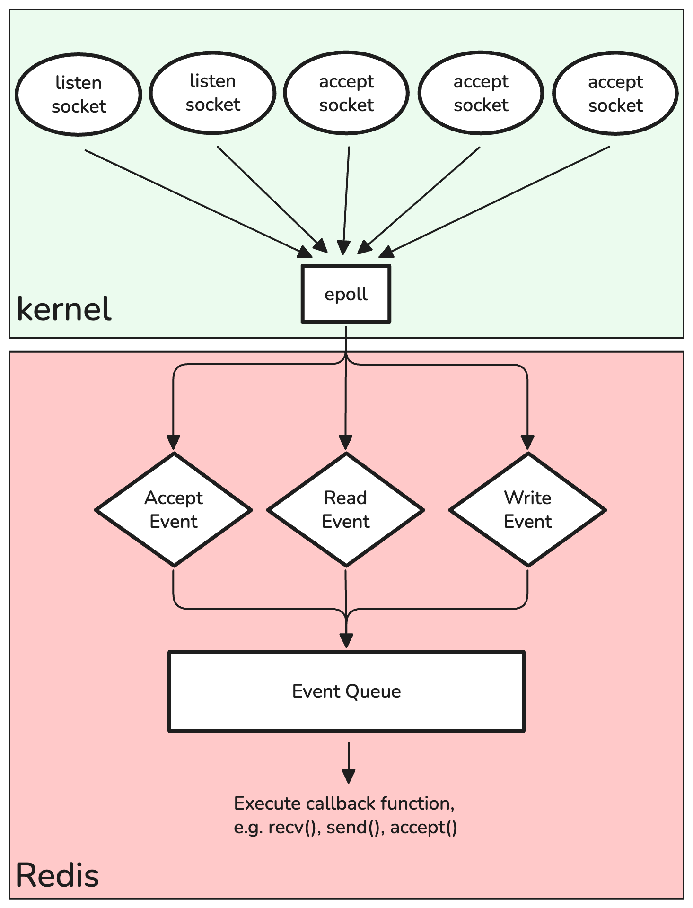
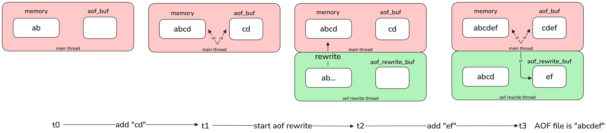

# Redis线程模型

#### ❓ Redis是单线程还是多线程?

Redis的单线程指的是其网络IO和键值对读写使用一个线程. 实际上Redis内部还是有子进程的. 他们作用于耗时的任务, 比如关闭文件, AOF持久化, 集群数据同步和清理内存等, 用于防止主线程被阻塞.


#### ❓ Redis为什么不使用多线程?

多线程在理论上是可以增加系统吞吐量的, 但是现实中多线程访问共享资源会出现竞争, 因此需要通过加锁来限制, 这样并发就变成了串行. 同时多线程也增加了代码的复杂度. 因此Redis选择了单线程.

#### ❓ Redis为什么这么快?
1. 大部分操作**基于内存**, 相较于磁盘, 处理速度更快, 支持的数据结构也更多, 算法实现也更简单
2. **单线程**避免了多线程的竞争和切换开销
3. 使用**IO多路复用**, 不会被阻塞

> 如果使用基本IO模型, 那么假设现在线程在通过IO的`recv()`接受数据, 如果客户端数据卡住一直没来, 那么Redis线程就会一直被阻塞无法响应其他请求.

#### ❓ Redis的单线程是怎么实现多路IO复用的?

Linux的IO多路复用指的是一个线程处理多个IO流, 它是通过`select/epoll`实现的.

在socket模型中, 不同的操作调用会返回不同的套接字(socket).
* `socket()`操作调用 &rarr; 返回*主动套接字*
* `listen()`操作调用 &rarr; 返回*监听套接字*, 可以设置成非阻塞, 即当Redis调用`accept()`但是一直没有连接请求到达时, Redis线程可以处理别的操作而非一直等待
* `accept()`操作调用 &rarr; 返回*已连接套接字*, 可以设置成非阻塞, 即当Redis调用`send()`/`recv()`时不用一直阻塞, 直到有数据到达时再来让Redis线程处理

而在Redis中, 内核会同时存在多个*监听套接字*和*已连接套接字*, 内核一直监听这些套接字上的连接和数据传输请求. 当有请求时才通知Redis来处理, 否则Redis线程可以服务其他操作.



1. `select/epoll`监测到套接字上是否有请求到达
2. 触发相应的事件, 比如accpetEvent, readEvent和writeEvent
3. 这些事件会被放进一个事件队列, Redis 单线程对该事件队列不断进行处理
4. Redis从队列取出事件时会调用相应的处理函数

---

# Redis持久化

#### ❓ AOF时为什么先执行命令再写AOF文件?

1. 避免额外检查开销 &rarr; 写命令失败就不需要记录在文件中了
2. 不会阻塞当前命令的执行

问题就是
1. 阻塞其他操作 &rarr; 记录命令也在主线程, 会阻塞后面的操作
2. 数据丢失 &rarr; 如果执行完就宕机, 日志没有记录内容

#### ❓ AOF重写为什么要两个缓冲区?


> 注意: 重写的时候并不是把aof中的指令进行重写, 而是直接对内存的数据模拟成指令.
> 
> 假设aof的指令是`SET key value1` &rarr; `SET key value2`, 重写直接读内存发现`key=value2`, 所以直接模拟一条`SET key value2`到重写后的aof文件.

---

# Redis高可用

#### ❓ 为什么主从实例的键数量不一致?

这并不代表主从数据不一致, 因为主实例内存中可能存在过期的键, 它们只有在被下次访问时才会被删除. 而主实例同步数据到从实例时, 使用RDB是不会包含这些过期键的.

#### ❓ Redis的复制是同步还是异步? 如何应对数据不一致?

主节点写数据的同时会写缓冲区, 然后异步发送给从节点.

正因为是异步的, 所以可能存在数据不一致. 解决办法如下:
* 保证主从节点网络连接状况良好, 减少网络时延导致的不一致
* 跟踪主节点写的进度和从节点读的进度之间的差值, 如果该差值太大则强行进行备份或阻塞主节点直到复制进度跟上

#### ❓ 主从切换如何减少数据丢失?

产生数据丢失的原因有:
* 异步复制丢失
* 集群脑裂 (网络无法相互访问)

**异步复制丢失**

跟踪主节点写的进度和从节点读的进度之间的差值, 如果该差值太大则让主节点拒接接受请求, 直到进度再次同步或者差值足够小.

**集群脑裂**

比如主机和从机断开连接, 客户端依旧访问主机, 而从机们因为哨兵存在会重新选主. 这样就会有不止一个主机.

当网络恢复, 由于哨兵选了新的主节点, 原来的主节点会降级, 然后企图同步新主节点信息. 又因为第一次同步是全量复制, 所以新主的内容会覆盖旧主, 这样脑裂期间旧主处理的数据就被抹除了.

我们可以设置Redis
* 主节点必须至少有n个从节点连接
* 主从节点复制的进度不能超过一个阈值

当不满足上述条件的时候就阻塞主节点提供服务. 这样即使脑裂, 旧主也无法提供服务, 新主从脑裂开始的时候记录新的数据. 当旧主重新连接并降级的时候, 因为停止提供服务了, 所以没有处理新的数据, 也就没有数据丢失.

#### ❓ 在Cluster集群中为什么Hash Slot使用2^14取模?

1. 网络带宽 &rarr; Cluster去中心化, 使用Gossip来沟通各个节点信息, 如果槽位太多那么消息就会太大
2. Redis集群主机数有限, 所以2^14保证每个主机都能有足够的槽位
3. 合适的hash碰撞率 &rarr; 槽位越多, hash碰撞概率越小, 2^14是一个碰撞率合适的配置

#### ❓ 为什么Redis Cluster不使用一致性哈希?

一致性哈希:
* 优点是**较少的数据迁移**, 因为是一个哈希环, 当某个主机宕机之后只需要把其负责的内容迁移到哈希环顺时针的下一个节点.
* 缺点是**数据倾斜**, 比如一个环上本来均匀分配, 但是某一节点宕机之后, 其环上下一个节点负责的数据量翻倍.
> 解决办法是再加一层*物理节点&rarr;虚拟节点*的映射.
> ```
> 物理节点1: 虚拟节点1 虚拟节点5 虚拟节点9
> 物理节点2: 虚拟节点2 虚拟节点6 虚拟节点A
> 物理节点3: 虚拟节点3 虚拟节点7 虚拟节点B
> 物理节点4: 虚拟节点4 虚拟节点8 虚拟节点C
> 
> 当物理节点2宕机之后, 重新均匀分配虚拟节点:
> 
> 物理节点1: 虚拟节点1 虚拟节点5 虚拟节点9 | 虚拟节点2
> 物理节点2: X
> 物理节点3: 虚拟节点3 虚拟节点7 虚拟节点B | 虚拟节点6
> 物理节点4: 虚拟节点4 虚拟节点8 虚拟节点C | 虚拟节点A
> ```

Redis Cluster使用哈希槽的来分片, 相比于一致性哈希追求最少的数据迁移, 哈希槽分片核心思想就是保证**数据分配均匀**. 而且由于是静态哈希槽, 可以非常容易的**手动分配槽位**(比如性能差的就少分一点槽位).

---

# Redis内存淘汰和过期删除

#### ❓ 主从结构中过期key怎么办?

从机不会进行过期扫描, 也就是说即使从机中的key过期了也能正常返回值.

从机中的过期键处理依赖主机, 主机key到期会在AOF中模拟一个del指令, 同步到从机后即可通过执行该命令删除过期.

#### ❓ 持久化时过期的key怎么办?

* RDB
  * 从内存到RDB文件 &rarr; 进行过期检查, 过期的内容不放入RDB文件中
  * 加载RDB更新内存 &rarr; 对于主机, 只会load没有过期的内容; 对于从机, 会load所有内容
* AOF
  * 写入AOF文件 &rarr; 对过期的key会模拟一条del指令
  * AOF重写 &rarr; 过期的key不会被重写

#### ❓ Redis内存满了怎么办?

Redis的运行内存到达阈值时会启动内存淘汰机制.

---

# Redis缓存

#### ❓ 为什么写操作的时候不是更新缓存, 而是删除缓存然后在下一次读操作的时候再写到缓存?

* 删除比更新而言是一个更简单的操作, 不容易出错
* 缓存数据可能是复杂数据, 比如聚合的结果
* 即使更新了数据也不代表会在短期内访问

综上, 没有必要去更新一个不一定被访问的大数据, 因为即使更新了也可能因为长期不访问被淘汰; 相反,先简单的删除,然后需要时再处理(lazy loading), 更加符合业务逻辑.

---

# Redis应用

#### ❓ Redis怎么实现延迟队列?

延迟队列就是把任务推迟执行, 比如下单后一定时间内不付款就取消.

可以使用ZSet的score特性来实现: 创建任务的时候使用score来存储时间戳(或类似), 然后通过`zrangebyscore`来获取一段时间内的待处理任务即可.

#### ❓ Redis事务能回滚吗?

Redis的每个单独操作是原子性的, 但是当把多个操作放到同一个事务里无法保证回滚. 即如果事务运行到一半出错或中止, 状态无法回到执行事务前.

#### ❓ Redis管道是什么?

把多个命令集中起来一起发送到Redis服务去处理, 相当于批处理(batch). 该功能能充分利用网络带宽, 有效减少网络开销.

#### ❓ Redis怎么做分布式锁? RedLock是什么?

分布式锁一般有几个要求:
* 互斥性 &rarr; 只有一个客户端能持有锁
* 不会死锁 &rarr; 一个客户端不能永远持有锁
* 容错性 &rarr; 锁状态不能只有一个服务端维护(防止单点故障), 需要多个节点达成共识
* 唯一性 &rarr; 加锁和解锁的是同一个客户端

加锁可以通过`SET lock_key unique_val NX PX 10000`:
* `lock_key`是锁的名字
* `unique_val`是客户端的uuid
* `NX`保证互斥性, 即只有`lock_key`不存在时才会设置
* `PX 10000`保证不会死锁, 即锁的有效时间为10秒, 避免了客户端异常导致锁无法释放

解锁可以通过Lua脚本实现原子性: 先判断请求的客户端和持有锁的客户端是同一个, 再删除该键值对.

使用Redis做分布式锁的特点
|优点|缺点|
|:---:|:---:|
|性能高效|`PX`的超时时间不好设置<sup>[*]</sup>|
|实现简单|Redis的主从复制异步, 如果主节点持有锁但是还未同步就宕机, 那么新的主节点仍然认为没有锁, 即多个节点获得不同的锁|
|容错性(Redis集群)||

> [*] 可以开一个守护线程, 当主线程仍然工作时, 不断的延长锁的生命周期, 直到主线程退出主动释放锁.

RedLock机制解决了集群情形下分布式锁的可靠性:
* 客户端获取当前时间t1
* 向集群内N个节点请求锁
  * 对于单个节点使用`SET lock_key unique_val NX PX ...`
  * 对于加锁的操作设置一个过期时间, 当加锁的操作过期则视为该节点无法加锁 (⚠️ 加锁操作的过期时间 &lt; 锁本身的过期时间)
* 超过半数节点成功获取锁, 客户端再次获取时间t2, 加锁成功要求: (1) 超过半数节点加锁; (2) 加锁过程耗时(t2-t1)小于锁本身的过期时间
* 一旦客户端成功获得分布式锁, 则重新计算锁的过期时间 (因为有一部分时间用于获取锁)

释放锁的时候直接向每个节点发送请求运行Lua脚本.

#### ❓ Redis大key有什么影响? 怎么删除大key?

大key指的是key对应的value很大(或者是键值对很大). 大key的问题在于:
1. 客户端超时 &rarr; 单线程处理大key会阻塞其他服务, 客户端会以为没有响应
2. 网络阻塞 &rarr; 加入高频读大key, 那么网络流量会非常大
3. 阻塞线程 &rarr; 容易阻塞主线程, 比如del删除, 或者是持久化
4. 内存分配不均 &rarr; 假设使用集群, 大key会使slot负载不均, 即某个slot数据量巨大

> [!NOTE]
> AOF持久化时, 当同步策略设置为always时, 主线程频繁调用`fsync()`会阻塞; RDB持久化和AOF重写时, 创建子线程和COW都会被大key给阻塞主线程.

在删除大key的时候我们可以尝试两种方法:
1. 分批次删除 &rarr; 每次取出大key的一部分进行删除, 比如大的list拆成多个小片段删除
2. 异步删除 &rarr; 使用`unlink`而非`del`, 并设置Redis在某些场景下使用异步删除

> [!NOTE]
> `unlink`使用异步线程来做删除, `del`使用主线程.

> [!NOTE]
> 以下几种场景可以设置使用异步删除:
> * `lazyfree-lazy-eviction` &rarr; 内存淘汰时是否使用lazy free
> * `lazyfree-lazy-expire` &rarr; 键值过期时是否使用lazy expire
> * `lazyfree-lazy-server-del` &rarr; 比如主机中键值过期时, 会模拟一个del指令放入aof, 我们可以设置为lazy free而非del
> * `slave-lazy-flush` &rarr; 从节点全量数据同步时可以使用lazy flush清空数据